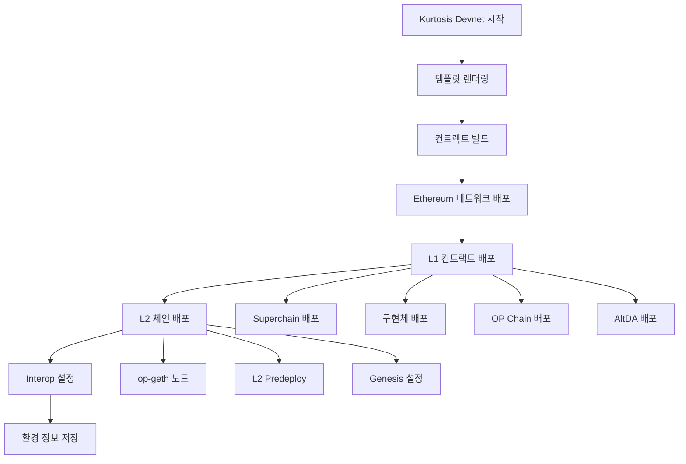
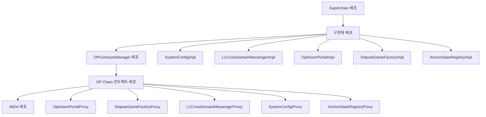

# Kurtosis를 이용한 Optimism 컨트랙트 배포 분석

## 개요

이 문서는 Kurtosis를 이용하여 Optimism 생태계의 컨트랙트들을 배포하는 과정과 구조를 상세히 분석합니다. Kurtosis는 개발 환경에서 복잡한 멀티체인 시스템을 쉽게 구성하고 배포할 수 있게 해주는 도구입니다.

## 🏗️ 전체 아키텍처

### 디렉토리 구조
```
kurtosis-devnet/
├── cmd/                    # 메인 애플리케이션 진입점
├── pkg/                    # 핵심 패키지
│   ├── build/             # 컨트랙트 빌드 관리
│   ├── deploy/            # 배포 로직
│   ├── kurtosis/          # Kurtosis 통합
│   └── system/            # 시스템 관리
├── templates/             # 배포 템플릿
├── tests/                 # 테스트 스크립트
└── *.yaml                 # 설정 파일들
```

### 핵심 컴포넌트

1. **Deployer** (`pkg/deploy/deploy.go`)
2. **ContractBuilder** (`pkg/build/contracts.go`)
3. **KurtosisDeployer** (`pkg/kurtosis/kurtosis.go`)
4. **Template System** (`templates/`)

## 🔧 배포 시스템 구조

### 1. 배포 파이프라인

```go
// pkg/deploy/deploy.go
type Deployer struct {
    kurtosisBinary    string
    ktDeployer        func(...kurtosis.KurtosisDeployerOptions) (deployer, error)
    newEnclaveFS      func(context.Context, string) (ktfs.EnclaveFS, error)
    engineManager     *engine.EngineManager
    enclaveManager    *enclave.KurtosisEnclaveManager
    tracer            trace.Tracer
}
```

**배포 과정:**
1. **템플릿 렌더링**: YAML 템플릿을 실제 설정으로 변환
2. **Kurtosis 배포**: Kurtosis 엔진을 통한 환경 배포
3. **상태 관리**: 배포된 환경 정보 저장 및 관리

### 2. 컨트랙트 빌드 시스템

```go
// pkg/build/contracts.go
type ContractBuilder struct {
    baseDir        string
    cmdTemplate    *template.Template
    dryRun         bool
    builtContracts map[string]string
    cmdFactory     func(string, ...string) *exec.Cmd
    enclaveManager *enclave.KurtosisEnclaveManager
    fs             afero.Fs
}
```

**빌드 과정:**
1. **컨트랙트 컴파일**: Forge를 이용한 Solidity 컴파일
2. **아티팩트 생성**: 컴파일된 컨트랙트를 아티팩트로 패키징
3. **배포 준비**: op-deployer가 사용할 수 있는 형태로 준비

## 📋 배포되는 컨트랙트들

### L1 컨트랙트 (op-deployer를 통해 배포)

#### **핵심 L1 컨트랙트**
- **`OptimismPortalProxy`**: L2에서 L1로의 출금 처리
- **`L1CrossDomainMessengerProxy`**: L1-L2 간 메시지 전달
- **`L1StandardBridgeProxy`**: 표준 토큰 브리지
- **`L1ERC721BridgeProxy`**: NFT 브리지
- **`SystemConfigProxy`**: 시스템 설정 관리
- **`ETHLockboxProxy`**: ETH 락박스

#### **Fault Proof 관련 컨트랙트**
- **`DisputeGameFactoryProxy`**: Dispute Game 생성 팩토리
- **`AnchorStateRegistryProxy`**: 앵커 상태 레지스트리
- **`PermissionedDisputeGame`**: 권한 기반 Dispute Game 구현체
- **`DelayedWETHPermissionedGameProxy`**: 권한 기반 Delayed WETH
- **`DelayedWETHPermissionlessGameProxy`**: 권한 없는 Delayed WETH

#### **관리 및 유틸리티 컨트랙트**
- **`ProxyAdmin`**: 프록시 관리자
- **`AddressManager`**: 주소 관리자
- **`OptimismMintableERC20FactoryProxy`**: Optimism 민팅 가능한 ERC20 팩토리

#### **Superchain 관련 컨트랙트**
- **`SuperchainConfigProxy`**: Superchain 설정
- **`ProtocolVersionsProxy`**: 프로토콜 버전 관리

#### **AltDA 관련 컨트랙트** (설정된 경우)
- **`DataAvailabilityChallengeProxy`**: 데이터 가용성 챌린지
- **`DataAvailabilityChallengeImpl`**: 데이터 가용성 챌린지 구현체

### L2 컨트랙트 (Predeploy)

L2에서는 다음과 같은 컨트랙트들이 predeploy됩니다:
- **`L2CrossDomainMessenger`**: L2 측 크로스 도메인 메신저
- **`L2StandardBridge`**: L2 측 표준 브리지
- **`L2ERC721Bridge`**: L2 측 NFT 브리지
- **`OptimismMintableERC20Factory`**: L2 측 ERC20 팩토리
- **`SequencerFeeWallet`**: 시퀀서 수수료 지갑
- **`GasPriceOracle`**: 가스 가격 오라클
- **`L1Block`**: L1 블록 정보
- **`L1MessageSender`**: L1 메시지 발신자
- **`DeployerWhitelist`**: 배포자 화이트리스트
- **`WETH`**: 래핑된 ETH
- **`ProxyAdmin`**: L2 프록시 관리자

## 🚀 배포 과정 상세 분석

### 1. 초기화 과정

```go
// cmd/main.go
func mainAction(c *cli.Context) error {
    // 1. OpenTelemetry 설정
    ctx, shutdown, err := telemetry.SetupOpenTelemetry(ctx, ...)

    // 2. 설정 파싱
    cfg, err := newConfig(c)

    // 3. Deployer 생성
    deployer, err := deploy.NewDeployer(
        deploy.WithKurtosisPackage(cfg.kurtosisPackage),
        deploy.WithEnclave(cfg.enclave),
        deploy.WithDryRun(cfg.dryRun),
        // ... 기타 옵션들
    )

    // 4. 환경 배포
    env, err := deployer.Deploy(ctx, nil)

    // 5. 환경 정보 저장
    writeEnvironment(cfg.environment, env)
    writeConductorConfig(cfg.conductorConfig, cfg.enclave)
}
```

### 2. 템플릿 렌더링

```go
// pkg/deploy/template.go
func (d *Deployer) renderTemplate(ctx context.Context, buildDir string,
    dataFile string, templateFile string) (io.Reader, error) {

    // 1. 데이터 파일 로드
    data, err := d.loadDataFile(dataFile)

    // 2. 템플릿 렌더링
    rendered, err := d.renderTemplateWithData(templateFile, data)

    // 3. 결과 반환
    return strings.NewReader(rendered), nil
}
```

### 3. Kurtosis 배포 실행

```go
// pkg/kurtosis/kurtosis.go
func (d *KurtosisDeployer) Deploy(ctx context.Context, input io.Reader) (*spec.EnclaveSpec, error) {
    // 1. 입력 스펙 파싱
    spec, err := d.enclaveSpec.EnclaveSpec(tee)

    // 2. Kurtosis 러너 생성
    kurtosisRunner, err := run.NewKurtosisRunner(...)

    // 3. 배포 실행
    if err := kurtosisRunner.Run(ctx, d.packageName, inputCopy); err != nil {
        return nil, err
    }

    return spec, nil
}
```

## 📊 설정 파일 분석

### 1. devnet.yaml 템플릿

```yaml
# templates/devnet.yaml
optimism_package:
  interop:
    enabled: true
    supervisor_params:
      image: {{ dig "overrides" "images" "op_supervisor" (localDockerImage "op-supervisor") $context }}
  chains:
    op-kurtosis-{{ $l2_id }}:
      {{ include "l2.yaml" (dict "chain_id" $l2_id "overrides" $overrides "nodes" $l2.nodes) }}
  op_contract_deployer_params:
    image: us-docker.pkg.dev/oplabs-tools-artifacts/images/op-deployer:v0.4.0-rc.2
    l1_artifacts_locator: {{ dig "overrides" "urls" "l1_artifacts" (localContractArtifacts "l1") $context }}
    l2_artifacts_locator: {{ dig "overrides" "urls" "l2_artifacts" (localContractArtifacts "l2") $context }}
    global_deploy_overrides:
      faultGameAbsolutePrestate: {{ dig "overrides" "deployer" "prestate" (localPrestate.Hashes.prestate_mt64) $context }}

ethereum_package:
  participants:
    - el_type: geth
      cl_type: teku
  network_params:
    preset: minimal
    genesis_delay: 5
```

### 2. 주요 설정 옵션들

#### **L2 체인 설정**
- **체인 ID**: 기본값 2151908, 2151909
- **노드**: op-geth 노드들
- **Interop 모드**: Supervisor RPC 지원

#### **컨트랙트 배포 설정**
- **op-deployer 이미지**: `v0.4.0-rc.2`
- **L1/L2 아티팩트**: 로컬 또는 원격 아티팩트 사용
- **배포 오버라이드**: prestate 해시 등

#### **Ethereum 네트워크 설정**
- **EL**: Geth
- **CL**: Teku
- **프리셋**: minimal
- **제네시스 딜레이**: 5초

## 🔄 배포 플로우

### 1. 전체 배포 플로우



### 2. 컨트랙트 배포 순서



## 🎯 주요 특징

### 1. 멀티체인 지원
- 여러 L2 체인을 동시에 배포 가능
- 각 체인별 독립적인 설정 지원
- Interop 모드를 통한 체인 간 상호작용

### 2. 모듈화된 구조
- 템플릿 기반 설정 시스템
- 컴포넌트별 독립적인 배포
- 재사용 가능한 배포 스크립트

### 3. 개발 친화적
- 로컬 개발 환경 최적화
- 빠른 배포 및 재시작
- 상세한 로깅 및 디버깅 지원

### 4. 확장성
- 새로운 컨트랙트 추가 용이
- 커스텀 설정 지원
- 플러그인 아키텍처

## 🚨 현재 제한사항

### 1. RAT 컨트랙트 미지원
- **문제**: RAT(Refund Address Tracker) 컨트랙트가 배포되지 않음
- **원인**: op-deployer의 배포 스크립트에 RAT 배포 로직이 없음
- **해결방안**:
  - `DeployOPChain.s.sol`에 RAT 배포 로직 추가
  - op-deployer에 RAT 배포 파이프라인 추가
  - kurtosis 설정에 RAT 배포 옵션 추가

### 2. 제한된 컨트랙트 커스터마이징
- 기본 배포 스크립트에 의존
- 커스텀 컨트랙트 배포 시 추가 작업 필요

### 3. 버전 관리
- op-deployer 이미지 버전이 고정됨
- 최신 컨트랙트 변경사항 반영 지연 가능

## 🔧 사용 예시

### 1. 기본 배포
```bash
# kurtosis-devnet 실행
go run ./kurtosis-devnet/cmd \
    --template-file templates/devnet.yaml \
    --data-file simple-input.yaml \
    --enclave optimism-devnet
```

### 2. Interop 모드 배포
```bash
# interop.yaml 사용
go run ./kurtosis-devnet/cmd \
    --template-file templates/devnet.yaml \
    --data-file interop.yaml \
    --enclave optimism-interop
```

### 3. 커스텀 설정 배포
```bash
# 커스텀 데이터 파일 사용
go run ./kurtosis-devnet/cmd \
    --template-file templates/devnet.yaml \
    --data-file custom-config.yaml \
    --enclave custom-devnet
```

## 📈 성능 특성

### 1. 배포 시간
- **전체 배포**: 약 5-10분 (하드웨어에 따라 다름)
- **재배포**: 약 2-3분 (캐시된 아티팩트 사용)
- **개별 컨트랙트**: 수초 내

### 2. 리소스 사용량
- **메모리**: 약 4-8GB
- **CPU**: 중간 수준
- **디스크**: 약 2-5GB

### 3. 최적화 포인트
- 컨트랙트 아티팩트 캐싱
- 병렬 배포 지원
- 증분 배포 기능

## 🔮 향후 계획

### 1. RAT 컨트랙트 지원
- RAT 배포 로직 추가
- 관련 설정 옵션 제공
- 테스트 및 검증

### 2. 성능 개선
- 배포 시간 단축
- 리소스 사용량 최적화
- 병렬 처리 강화

### 3. 사용성 개선
- 더 직관적인 설정 시스템
- 향상된 에러 메시지
- 자동화된 테스트

## 📚 관련 문서

- [Kurtosis 공식 문서](https://docs.kurtosis.com/)
- [op-deployer 사용 가이드](../op-deployer/book/)
- [Optimism 컨트랙트 문서](https://docs.optimism.io/builders/chain-operators/configuration/proposer)
- [Fault Proof 시스템](../fault-proof/)

---

이 문서는 Kurtosis를 이용한 Optimism 생태계 배포 시스템의 종합적인 분석입니다. 개발 환경에서 복잡한 멀티체인 시스템을 쉽게 구성하고 배포할 수 있는 강력한 도구로, 지속적인 개선을 통해 더욱 완성도 높은 개발 환경을 제공하고 있습니다.
