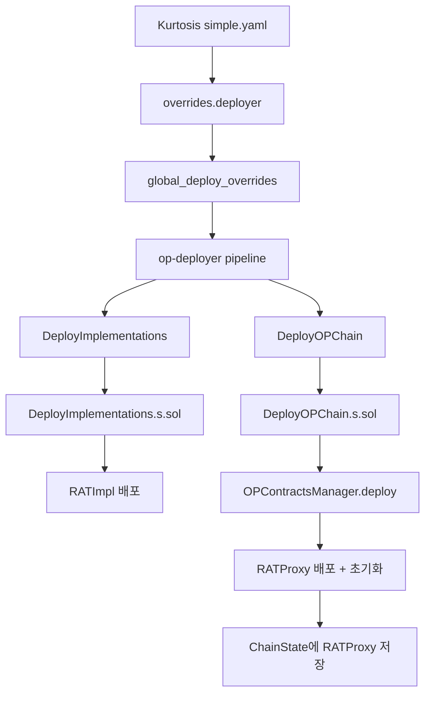

# RAT (Refund Address Tracker) 배포 구현 분석

## 📋 개요

이 문서는 Optimism의 RAT (Refund Address Tracker) 컨트랙트를 Kurtosis 개발 환경에서 배포하기 위한 전체 구현 과정을 분석하고 정리합니다.

## 🎯 RAT 컨트랙트 개요

### RAT의 역할
- **Challenger 모니터링**: Dispute Game에서 challenger들의 활동을 추적
- **테스트 지원**: 개발 및 테스트 환경에서 challenger 동작 검증
- **보증금 관리**: 테스트용 보증금 및 증거 제출 기간 관리

### RAT 컨트랙트 구조
```solidity
contract RAT is ProxyAdminOwnedBase, ReinitializableBase, Initializable, ReentrancyGuard, ISemver {
    struct ChallengerInfo {
        uint256 stakingAmount;      // 스테이킹 금액
        uint256 totalSlashedAmount; // 총 슬래시된 금액
        uint32 validatorIndex;      // 검증자 인덱스
        bool isValid;               // 유효성 여부
    }

    struct AttentionInfo {
        bytes32 stateRoot;          // 상태 루트
        uint96 bondAmount;          // 보증금 금액 (uint96로 address와 패킹)
        address challengerAddress;  // challenger 주소 (uint96와 패킹)
        uint64 l1BlockNumber;       // L1 블록 번호
        bool evidenceSubmitted;     // 증거 제출 여부
    }
}
```

## 🏗️ 배포 아키텍처

### 전체 배포 플로우


### 배포 구성 요소
1. **Kurtosis 설정**: `simple.yaml`에서 RAT 파라미터 정의
2. **op-deployer 파이프라인**: Go 코드에서 배포 로직 처리
3. **Solidity 스크립트**: 실제 컨트랙트 배포 실행
4. **OPContractsManager**: 통합 배포 관리

## 📁 구현된 파일들

### 1. Kurtosis 설정 파일

#### `kurtosis-devnet/simple.yaml`
```yaml
overrides:
  deployer:
    # RAT (Refund Address Tracker) configuration
    deployRAT: true
    perTestBondAmount: 100000000000000          # 0.0001 ETH in wei
    evidenceSubmissionPeriod: 600                # 10 minutes in seconds
    minimumStakingBalance: 1000000000000000000    # 1 ETH in wei
    ratTriggerProbability: 100000                   # 100% (100000/100000)
    ratManager: "0xf39Fd6e51aad88F6F4ce6aB8827279cffFb92266"  # First prefunded account

optimism_package:
  op_contract_deployer_params:
    overrides:
      # RAT configuration (중복 설정)
      deployRAT: true
      perTestBondAmount: 100000000000000
      evidenceSubmissionPeriod: 600
      minimumStakingBalance: 1000000000000000000
      ratTriggerProbability: 100000
      ratManager: "0xf39Fd6e51aad88F6F4ce6aB8827279cffFb92266"
```

### 2. Solidity 컨트랙트 및 스크립트

#### `packages/contracts-bedrock/src/L1/RAT.sol`
- RAT 컨트랙트의 메인 구현체
- `initialize` 함수로 초기화 파라미터 설정
- Proxy 패턴으로 배포

#### `packages/contracts-bedrock/scripts/deploy/DeployImplementations.s.sol`
```solidity
function run(Input memory _input) public returns (Output memory output_) {
    // ... 기타 구현체 배포
    deployRATImpl(output_);  // RAT 구현체 배포
    // ...
}

function deployRATImpl(Output memory _output) private {
    IRAT impl = IRAT(
        DeployUtils.createDeterministic({
            _name: "RAT",
            _args: DeployUtils.encodeConstructor(abi.encodeCall(IRAT.__constructor__, ())),
            _salt: _salt
        })
    );
    vm.label(address(impl), "RATImpl");
    _output.ratImpl = impl;
}
```

#### `packages/contracts-bedrock/scripts/deploy/DeployOPChain.s.sol`
```solidity
struct DeployOPChainInput {
    // ... 기타 필드들
    // RAT configuration parameters
    bool deployRAT;
    uint256 perTestBondAmount;
    uint256 evidenceSubmissionPeriod;
    uint256 minimumStakingBalance;
    uint256 ratTriggerProbability;
    address ratManager;
}

struct DeployOPChainOutput {
    // ... 기타 필드들
    IRAT ratProxy;
}
```

#### `packages/contracts-bedrock/src/L1/OPContractsManager.sol`
```solidity
// RAT 배포 로직
if (_input.deployRAT) {
    output.ratProxy = IRAT(
        deployProxy(_input.l2ChainId, output.opChainProxyAdmin, _input.saltMixer, "RAT")
    );

    data = encodeRATInitializer(_input, output);
    upgradeToAndCall(
        output.opChainProxyAdmin,
        address(output.ratProxy),
        implementation.ratImpl,
        data
    );
}

function encodeRATInitializer(
    OPContractsManager.DeployInput memory _input,
    OPContractsManager.DeployOutput memory _output
) internal view virtual returns (bytes memory) {
    return abi.encodeCall(
        IRAT.initialize,
        (
            address(_output.disputeGameFactoryProxy), // _disputeGameFactory
            _input.perTestBondAmount,              // _perTestBondAmount
            _input.evidenceSubmissionPeriod,       // _evidenceSubmissionPeriod
            _input.minimumStakingBalance,          // _minimumStakingBalance
            _input.ratTriggerProbability,             // _ratTriggerProbability
            _input.ratManager                         // _manager
        )
    );
}
```

### 3. Go 코드 (op-deployer)

#### `op-deployer/pkg/deployer/state/chain_intent.go`
```go
type ChainIntent struct {
    // ... 기타 필드들
    // RAT configuration
    DeployRAT                    bool          `json:"deployRAT" toml:"deployRAT"`
    RATPerTestBondAmount         uint64        `json:"perTestBondAmount" toml:"perTestBondAmount"`
    RATEvidenceSubmissionPeriod  *big.Int      `json:"evidenceSubmissionPeriod" toml:"evidenceSubmissionPeriod"`
    RATMinimumStakingBalance     *big.Int      `json:"minimumStakingBalance" toml:"minimumStakingBalance"`
    RATTriggerProbability        uint64        `json:"ratTriggerProbability" toml:"ratTriggerProbability"`
    RATManager                   common.Address `json:"ratManager" toml:"ratManager"`
}
```

#### `op-deployer/pkg/deployer/standard/standard.go`
```go
const (
    // RAT defaults
    DeployRAT                    bool   = false
    RATPerTestBondAmount         string = "10000000000000000" // 0.01 ETH
    RATEvidenceSubmissionPeriod  uint64 = 3600                // 1 hours
    RATMinimumStakingBalance     string = "1000000000000000000" // 1 ETH
    RATTriggerProbability        uint64 = 10000                 // 10% (10000/100000)
)
```

#### `op-deployer/pkg/deployer/pipeline/opchain.go`
```go
func makeDCI(intent *state.Intent, thisIntent *state.ChainIntent, chainID common.Hash, st *state.State) (opcm.DeployOPChainInput, error) {
    proofParams, err := jsonutil.MergeJSON(
        state.SuperchainProofParams{
            // ... 기타 표준 값들
            // RAT defaults
            DeployRAT:                   standard.DeployRAT,
            RATPerTestBondAmount:        mustHexBigFromHex(standard.RATPerTestBondAmount),
            RATEvidenceSubmissionPeriod: standard.RATEvidenceSubmissionPeriod,
            RATMinimumStakingBalance:    mustHexBigFromHex(standard.RATMinimumStakingBalance),
            RATTriggerProbability:       standard.RATTriggerProbability,
            RATManager:                  common.Address{}, // Default to zero address
        },
        intent.GlobalDeployOverrides,  // Kurtosis에서 전달된 오버라이드
        thisIntent.DeployOverrides,
    )

    return opcm.DeployOPChainInput{
        // ... 기타 필드들
        // RAT configuration
        DeployRAT:                    proofParams.DeployRAT,
        RATPerTestBondAmount:         proofParams.RATPerTestBondAmount,
        RATEvidenceSubmissionPeriod:  proofParams.RATEvidenceSubmissionPeriod,
        RATMinimumStakingBalance:     proofParams.RATMinimumStakingBalance,
        RATTriggerProbability:        proofParams.RATTriggerProbability,
        RATManager:                   proofParams.RATManager,
    }, nil
}
```

#### `op-deployer/pkg/deployer/pipeline/implementations.go`
```go
st.ImplementationsDeployment = &addresses.ImplementationsContracts{
    // ... 기타 구현체들
    RATImpl: dio.RATImpl,  // RAT 구현체 주소 저장
}
```

#### `op-chain-ops/addresses/contracts.go`
```go
type ImplementationsContracts struct {
    // ... 기타 구현체들
    RATImpl common.Address  // RAT 구현체 주소 필드 추가
}

type OpChainFaultProofsContracts struct {
    // ... 기타 프록시들
    RATProxy common.Address  // RAT 프록시 주소 필드
}
```

## 🔧 설정 파라미터 상세

### RAT 초기화 파라미터

| 파라미터 | 타입 | 기본값 | 설명 |
|---------|------|--------|------|
| `deployRAT` | bool | false | RAT 배포 여부 |
| `ratPerTestBondAmount` | uint64 | 0.01 ETH | 테스트당 보증금 |
| `ratEvidenceSubmissionPeriod` | uint64 | 3600초 | 증거 제출 기간 |
| `minimumStakingBalance` | uint64 | 1 ETH | 최소 스테이킹 잔액 |
| `ratTriggerProbability` | uint64 | 10000 | 트리거 확률 (10000/100000 = 10%) |
| `ratManager` | address | zero address | RAT 관리자 주소 |

### 타입 변환 처리

#### Solidity vs Go 타입 매핑
- **Solidity `uint96`** ↔ **Go `uint64`**: `ratPerTestBondAmount`
- **Solidity `uint64`** ↔ **Go `uint64`**: `evidenceSubmissionPeriod`, `minimumStakingBalance`, `ratTriggerProbability`
- **Solidity `address`** ↔ **Go `common.Address`**: `ratManager`

#### 타입 변환 처리

**1. simple.yaml → Go 변환:**
```yaml
# simple.yaml (숫자 값)
ratPerTestBondAmount: 100000000000000          # 0.0001 ETH
ratMinimumStakingBalance: 1000000000000000000    # 1 ETH
```

**2. standard.go → Go 변환:**
```go
// standard.go (hex 문자열)
RATPerTestBondAmount         string = "10000000000000000" // 0.01 ETH
RATMinimumStakingBalance     string = "1000000000000000000" // 1 ETH

// hex 문자열을 *big.Int로 변환
mustHexBigFromHex(standard.RATPerTestBondAmount)  // "10000000000000000" → *big.Int
```

**3. JSON 병합 과정:**
```go
// simple.yaml의 숫자 값이 standard.go의 hex 문자열을 오버라이드
proofParams, err := jsonutil.MergeJSON(
    state.SuperchainProofParams{
        RATPerTestBondAmount: mustHexBigFromHex(standard.RATPerTestBondAmount), // 기본값
        // ...
    },
    intent.GlobalDeployOverrides,  // simple.yaml 값으로 오버라이드
)
```

## 🚀 배포 실행 과정

### 1. Kurtosis 시작
```bash
kurtosis dev up --config-file simple.yaml
```

### 2. 설정 전달 과정
1. **Kurtosis** → `overrides.deployer` → `global_deploy_overrides`
2. **op-deployer** → `intent.GlobalDeployOverrides` → `proofParams`
3. **DeployOPChainInput** → `OPContractsManager.deploy`

### 3. 실제 배포 단계
1. **구현체 배포**: `DeployImplementations.s.sol`에서 `RATImpl` 배포
2. **프록시 배포**: `OPContractsManager.deploy`에서 `RATProxy` 배포
3. **초기화**: `RAT.initialize` 함수 호출로 파라미터 설정
4. **상태 저장**: `ChainState`에 `RATProxy` 주소 저장

## ⚠️ 주의사항 및 해결된 문제들

### 1. 타입 불일치 문제
- **문제**: Solidity `uint96` vs Go `uint64` 타입 불일치
- **해결**: `ratPerTestBondAmount`를 `uint64` 범위 내 값으로 설정

### 2. 중복 설정 문제
- **문제**: `simple.yaml`에서 `overrides.deployer`와 `optimism_package.op_contract_deployer_params.overrides` 중복
- **해결**: 두 곳 모두에 동일한 RAT 설정 추가

### 3. 불필요한 파일 생성
- **문제**: `DeployRAT.s.sol`, `SetRATImpl.s.sol` 등 별도 스크립트 생성
- **해결**: 기존 `DeployImplementations.s.sol`과 `OPContractsManager`에서 처리하도록 통합

## 📊 검증 방법

### 1. 배포 확인
```bash
# RAT 프록시 주소 확인
kurtosis service logs op-deployer

# 컨트랙트 초기화 상태 확인
cast call <RAT_PROXY_ADDRESS> "version()" --rpc-url <L1_RPC_URL>
```

### 2. 설정 검증
```bash
# RAT 파라미터 확인
cast call <RAT_PROXY_ADDRESS> "perTestBondAmount()" --rpc-url <L1_RPC_URL>
cast call <RAT_PROXY_ADDRESS> "evidenceSubmissionPeriod()" --rpc-url <L1_RPC_URL>
cast call <RAT_PROXY_ADDRESS> "manager()" --rpc-url <L1_RPC_URL>
```

## 🎯 결론

RAT 배포 구현이 완료되었으며, 다음과 같은 특징을 가집니다:

1. **통합된 배포 시스템**: 기존 OP Stack 배포 시스템과 완전히 통합
2. **유연한 설정**: Kurtosis를 통한 쉬운 파라미터 조정
3. **타입 안전성**: Solidity와 Go 간 타입 변환 처리
4. **확장성**: 향후 RAT 기능 확장에 대비한 구조

이제 Kurtosis 개발 환경에서 RAT 컨트랙트를 성공적으로 배포하고 테스트할 수 있습니다.
