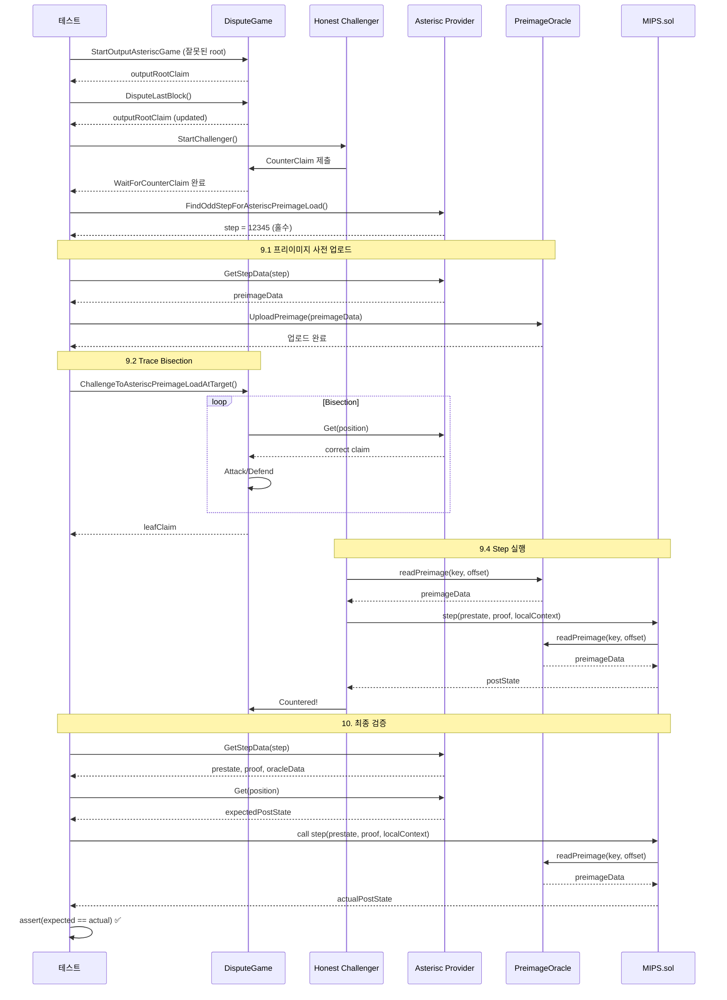

# TestOutputAsteriscStepWithPreimage_existingPreimage 테스트 시나리오 상세 분석

## 개요

**테스트 목적**: 이미 온체인에 업로드된 프리이미지를 **재사용**하여 Asterisc step을 검증합니다. 이는 중복 업로드를 방지하고 프리이미지 재사용 로직이 올바르게 작동하는지 확인합니다.

**테스트 파일**: `op-e2e/faultproofs/output_asterisc_test.go`
**Helper 파일**: `op-e2e/e2eutils/disputegame/asterisc_helper.go`

## 실행 명령어

```bash
go test -v -timeout 20m ./op-e2e/faultproofs \
  -run "^TestOutputAsteriscStepWithPreimage_existingPreimage$/asterisc$"
```

## 테스트 흐름 다이어그램

```
1. 환경 설정 (Keccak256, preloadPreimage=true)
   ↓
2. 시스템 부팅 (L1/L2, Blob batches)
   ↓
3. 분쟁 게임 생성 (잘못된 output root)
   ↓
4. Honest Challenger 시작
   ↓
5. 실행 게임 생성 대기 (WaitForCounterClaim)
   ↓
6. 프리이미지 로드 검증 준비
   ↓
7. Asterisc Trace Provider 생성
   ↓
8. 프리이미지 로드 위치 탐색 (홀수 step)
   ↓
9. 프리이미지 로드 유도 ⭐ (Line 276 함수 호출)
   ├─ 9.1 프리이미지 사전 업로드 ⭐⭐ (이 시점에 업로드!)
   ├─ 9.2 Trace 분기 (Bisection)
   ├─ 9.3 프리이미지 로드 검증
   └─ 9.4 Step 실행 대기
   ↓
10. 최종 검증 (온체인 step 호출 및 비교)
```

**중요**: 프리이미지 업로드는 **9.1 단계에서 처음 실행**됩니다!

---

## 단계별 상세 설명

### 1. 환경 설정 (line 244-247)

```go
conf := utils.PreimageOptConfigForType(oppreimage.Keccak256KeyType)
testAsteriscPreimageStep(t, allocType, conf, true) // preloadPreimage = true
```

**설정값**:
- **프리이미지 타입**: `Keccak256` (로컬 키 타입, prefix: `0x01`)
- **핵심 파라미터**: `preloadPreimage = true` → 프리이미지 업로드 활성화

**의미**:
- `preloadPreimage = true`는 "업로드하겠다"는 **의도를 전달**하는 플래그
- **실제 업로드는 아직 일어나지 않음** - Line 276에서 실행됨
- 이 테스트는 프리이미지가 **이미 존재하는 상황**을 시뮬레이션
- 중복 업로드가 발생하지 않고 재사용되는지 검증

**업로드 시점**:
- ❌ 이 시점에서 업로드하지 **않음**
- ✅ Line 276 `ChallengeToAsteriscPreimageLoadAtTarget()` 함수 내부에서 업로드

---

### 2. 시스템 부팅 (line 251-253)

```go
ctx := context.Background()
sys, _ := StartFaultDisputeSystem(t, WithBlobBatches(), WithAllocType(allocType))
t.Cleanup(sys.Close)
```

**부팅되는 컴포넌트**:
- L1 개발 체인 (Geth)
- L2 개발 체인 (op-geth)
- Sequencer (트랜잭션 정렬)
- Batcher (L1에 배치 제출)
- Proposer (output root 제안)
- **Blob batches 활성화**: EIP-4844 blob 데이터 지원

**AllocType**:
- `config.AllocTypeAsterisc` → RISC-V VM 사용
- DisputeGameFactory에 GameType 2 등록

---

### 3. 분쟁 게임 생성 (line 255-259)

```go
disputeGameFactory := disputegame.NewFactoryHelper(t, ctx, sys)
game := disputeGameFactory.StartOutputAsteriscGame(ctx, "sequencer", 1, common.Hash{0x01, 0xaa})
require.NotNil(t, game)
outputRootClaim := game.DisputeLastBlock(ctx)
game.LogGameData(ctx)
```

**동작**:
1. **DisputeGameFactory**: GameType 2 (Asterisc) 게임 팩토리
2. **StartOutputAsteriscGame**: L2 블록 #1에 대한 **잘못된 output root** 제출
   - Root claim: `0x01aa...` (의도적으로 잘못된 값)
3. **DisputeLastBlock**: 마지막 블록에 대한 분쟁 시작
   - 반환값: `outputRootClaim` (분쟁 대상 claim)

**게임 구조**:
```
DisputeGame (GameType 2: Asterisc)
├─ Output Root Claim (잘못된 값)
│  └─ Split depth까지 output 게임
└─ Execution Trace (Asterisc VM)
   └─ Split depth 이후 실행 게임
```

---

### 4. Honest Challenger 시작 (line 261)

```go
game.StartChallenger(ctx, "Challenger",
    challenger.WithPrivKey(sys.Cfg.Secrets.Alice))
```

**참고**: `challenger.WithAsterisc(t, sys)` 옵션이 명시되지 않았습니다.

**하지만 이것은 문제가 아닙니다!**
- `StartOutputAsteriscGame()`로 게임을 생성하면 게임 타입이 **GameType 2 (Asterisc)** 로 설정됨
- Challenger가 시작할 때 게임 컨트랙트를 조회하여 자동으로 올바른 VM 타입을 감지
- 게임 타입에 따라 자동으로 **Asterisc VM (RISC-V)** 사용

**Challenger 내부 로직**:
```go
// Challenger가 게임 타입 확인
gameType := game.GameType()  // GameType 2 (Asterisc)

// 자동으로 올바른 VM 선택
if gameType == 2 {
    vm = NewAsteriscVM()  // RISC-V VM
} else if gameType == 0 || gameType == 1 {
    vm = NewCannonVM()    // MIPS VM
}
```

**결론**: `WithAsterisc()` 옵션은 선택사항이며, 게임 타입에 따라 자동 선택됨

---

### 5. 실행 게임 생성 대기 (line 265)

```go
outputRootClaim = outputRootClaim.WaitForCounterClaim(ctx)
```

**동작**:
1. Honest challenger가 잘못된 output root claim을 감지
2. Output root claim을 **반박** (counter claim 제출)
3. **실행 게임(execution game)의 루트** 생성
4. 이제 honest challenger는 **실행 게임의 defender** 위치

**게임 트리 진행**:
```
Before:
  Root (잘못된 output root)

After:
  Root (잘못된 output root)
  └─ CounterClaim (honest challenger) ← outputRootClaim 업데이트
     └─ 실행 게임 시작 지점
```

---

### 6. 프리이미지 로드 검증 준비 (line 270-271)

```go
getExpectedData := func(p *types.PreimageOracleData) (bool, [32]byte) {
    return true, game.GetPreimageAtOffset(p)
}
preimageLoadCheck := game.CreateStepPreimageLoadStrictCheck(ctx, getExpectedData)
```

**목적**:
- 프리이미지가 오라클에 **올바른 데이터**로 로드되었는지 검증하는 함수 생성

**동작**:
- `GetPreimageAtOffset(p)`: 특정 offset의 프리이미지 데이터 반환
- `CreateStepPreimageLoadStrictCheck`:
  - 온체인 `PreimageOracle.preimageParts()` 조회
  - 기대값과 실제값 비교
  - 불일치 시 에러 반환

---

### 7. Asterisc Trace Provider 생성 (line 274)

```go
providerFunc := game.NewMemoizedAsteriscTraceProvider(ctx, "sequencer", outputRootClaim,
    challenger.WithPrivKey(sys.Cfg.Secrets.Alice))
```

**Memoized Pattern**:
- **한 번만 생성**하고 이후 호출 시 **캐시된 인스턴스 재사용**
- 성능 최적화 (trace 생성 비용이 높음)

**내부 동작** (`asterisc_helper.go:33-82`):
```go
func (g *CannonHelper) NewMemoizedAsteriscTraceProvider(...) AsteriscTraceProviderFunc {
    var provider *asterisc.AsteriscTraceProviderForTest
    var localContext common.Hash
    return func() (*asterisc.AsteriscTraceProviderForTest, common.Hash, *ClaimHelper) {
        if provider == nil {
            provider, localContext = g.createAsteriscTraceProvider(...)
        }
        return provider, localContext, outputRootClaim
    }
}
```

**생성되는 컴포넌트**:
1. **Output Provider**: L2 output root 제공
2. **Split Provider**: Output 게임과 실행 게임 분리
3. **Asterisc Trace Provider**: RISC-V trace 생성
   - `asterisc.NewTraceProviderForTest()`
   - Asterisc VM 바이너리 실행
   - op-program 서버와 통신

---

### 8. 프리이미지 로드 위치 탐색 (line 275)

```go
step := game.FindOddStepForAsteriscPreimageLoad(ctx, providerFunc, preimageOptConfig, opts...)
```

**목표**: Keccak256 프리이미지를 로드하는 **홀수 trace index**를 찾습니다.

**왜 홀수 step이어야 하는가?**

| Step 인덱스 | 누가 증거를 제출? | 역할 |
|------------|-----------------|------|
| **짝수** | Attacker | 공격측이 post-state 제출 |
| **홀수** | Defender | 방어측이 post-state 제출 |

- Honest challenger가 **defender** 위치이므로 **홀수 step**에서 증거 제출
- 프리이미지 로드 증거를 제출하려면 홀수 인덱스 필요

**상세 동작** (`asterisc_helper.go:85-130`):

```go
func (g *CannonHelper) FindOddStepForAsteriscPreimageLoad(...) uint64 {
    var lastStep uint64 = 0

    // Skip 요청된 preimage load들
    for i := 0; i < config.skipNPreimageLoads; i++ {
        preimageOpt = poConfig.PreimageLoad()
        step, err := provider.FindStep(ctx, lastStep, preimageOpt)
        lastStep = step
        poConfig.AfterStep = step + 1
    }

    // 홀수 step 찾기
    for {
        step, err := provider.FindStep(ctx, lastStep, preimageOpt)
        if errors.Is(err, io.EOF) {
            // 프리이미지 로드를 찾지 못함
            if config.allowEvenFallback && lastStep > lastSkippedStep {
                return lastStep  // 짝수 step으로 fallback
            } else {
                g.t.Fatalf("홀수 step을 찾지 못함")
            }
        }
        if step%2 == 1 {
            return step  // ✅ 홀수 step 발견!
        }
        lastStep = step
        poConfig.AfterStep = step + 1
    }
}
```

**검색 과정**:
1. `provider.FindStep()`: Asterisc VM trace에서 프리이미지 로드 검색
2. Keccak256 타입 필터 적용
3. 홀수 인덱스일 때까지 반복
4. 찾으면 반환

---

### 9. 프리이미지 로드 유도 (핵심!) (line 276)

```go
game.ChallengeToAsteriscPreimageLoadAtTarget(ctx, providerFunc, step, preimageLoadCheck, true)
                                                                                         ↑
                                                                            preloadPreimage = true
```

이것이 테스트의 **핵심 부분**입니다. 마지막 파라미터 `true`는 Line 246에서 전달된 `preloadPreimage` 값입니다.

**⭐ 이 함수가 호출되는 순간, 프리이미지 업로드가 실행됩니다!**

#### 9.1 프리이미지 사전 업로드 (`asterisc_helper.go:150-155`)

**이 단계에서 비로소 프리이미지가 온체인에 업로드됩니다!**

```go
if preloadPreimage {
    _, _, preimageData, err := provider.GetStepData(ctx,
        types.NewPosition(execDepth, big.NewInt(int64(targetTraceIndex))))
    g.require.NoError(err)
    g.UploadPreimage(ctx, preimageData)
    g.WaitForPreimageInOracle(ctx, preimageData)
}
```

**단계별 동작**:

##### A. GetStepData - 프리이미지 데이터 가져오기

```go
_, _, preimageData, err := provider.GetStepData(ctx, position)
```

**반환값**:
- `prestate`: Step 실행 전 VM 상태
- `proof`: Merkle proof (상태 witness)
- **`preimageData`**: 프리이미지 oracle 데이터 ⭐

**프리이미지 데이터 구조**:
```go
type PreimageOracleData struct {
    Key         common.Hash    // Keccak256(원본 데이터)
    Data        []byte         // 원본 프리이미지 데이터
    Offset      uint64         // 데이터 offset
    IsLocal     bool           // 로컬(Keccak256) vs 글로벌(SHA256)
}
```

##### B. UploadPreimage - 온체인 업로드

```go
g.UploadPreimage(ctx, preimageData)
```

**동작**:
1. 프리이미지 데이터를 여러 **part**로 분할 (각 part는 최대 32 bytes)
2. 각 part마다 트랜잭션 전송:
   ```solidity
   PreimageOracle.loadKeccak256PreimagePart(
       uint256 partOffset,
       bytes calldata preimage
   )
   ```
3. 컨트랙트가 각 part를 저장:
   ```solidity
   mapping(bytes32 => mapping(uint256 => bytes32)) public preimageParts;
   ```

**예시**:
```
원본 데이터: "Hello, World! This is a test preimage."
→ 40 bytes

Part 0 (offset 0):  "Hello, World! This is a test pr"  (32 bytes)
Part 1 (offset 32): "eimage."                           (7 bytes)

Tx 1: loadKeccak256PreimagePart(0, "Hello, World! This is a test pr")
Tx 2: loadKeccak256PreimagePart(32, "eimage.")
```

##### C. WaitForPreimageInOracle - 업로드 완료 대기

```go
g.WaitForPreimageInOracle(ctx, preimageData)
```

**검증 로직**:
```go
for offset < len(preimageData.Data) {
    part, err := oracle.ReadPreimage(ctx, preimageData.Key, offset)
    require.NoError(err)
    require.Equal(expected, part)  // 데이터 일치 확인
    offset += 32
}
```

**온체인 조회**:
```solidity
function readPreimage(bytes32 _key, uint256 _offset)
    external view returns (bytes32 part_) {
    part_ = preimageParts[_key][_offset];
}
```

#### 9.2 Trace 분기 (Bisection) (`asterisc_helper.go:157-163`)

```go
bisectTraceIndex := func(claim *ClaimHelper) *ClaimHelper {
    return traceBisectionAsterisc(g.t, ctx, claim, splitDepth, execDepth, targetTraceIndex, provider)
}
mover := bisectTraceIndex(outputRootClaim)
leafClaim := g.splitGame.DefendClaim(ctx, mover, bisectTraceIndex, WithoutWaitingForStep())
```

**목표**: `targetTraceIndex`에서 step을 실행하도록 게임 트리를 탐색

**Bisection 전략** (`asterisc_helper.go:173-237`):

```
게임 트리 구조:
                     Root (outputRootClaim)
                    /                      \
            [Attack/Defend]            [Attack/Defend]
              /         \                /         \
          [Claim]    [Claim]        [Claim]    [Claim]
            ...         ...           ...         ...

                    Leaf (targetTraceIndex)
                        ↓
                  Step execution required
```

**알고리즘**:

```go
func traceBisectionAsterisc(...) *ClaimHelper {
    execClaimPosition, _ := claim.Position.RelativeToAncestorAtDepth(splitDepth + 1)
    claimTraceIndex := execClaimPosition.TraceIndex(execDepth).Uint64()

    // Leaf 노드 (depth == execDepth-1) 처리
    if execClaimPosition.Depth() == execDepth-1 {
        if claimTraceIndex == targetTraceIndex {
            // Case 1: 타겟과 정확히 일치 → Attack (올바른 값)
            correct, _ := provider.Get(ctx, execClaimPosition.Attack())
            return claim.Attack(ctx, correct)
        } else if claimTraceIndex > targetTraceIndex {
            // Case 2: 타겟보다 오른쪽 → Attack (잘못된 값)
            return claim.Attack(ctx, common.Hash{0xdd})
        } else if claimTraceIndex + 1 == targetTraceIndex {
            // Case 3: 타겟 바로 왼쪽 → Defend (잘못된 값)
            return claim.Defend(ctx, common.Hash{0xcc})
        } else {
            // Case 4: 타겟보다 왼쪽 → Defend (올바른 값)
            correct, _ := provider.Get(ctx, execClaimPosition.Defend())
            return claim.Defend(ctx, correct)
        }
    }

    // 중간 노드: 타겟 방향으로 이동
    if claimTraceIndex < targetTraceIndex {
        // 타겟이 오른쪽 → Defend
        newPosition := execClaimPosition.Defend()
        if newPosition.TraceIndex(execDepth).Uint64() < targetTraceIndex {
            correct, _ := provider.Get(ctx, newPosition)
            return claim.Defend(ctx, correct)  // 올바른 값
        } else {
            return claim.Defend(ctx, common.Hash{0xaa})  // 잘못된 값
        }
    } else {
        // 타겟이 왼쪽 → Attack
        newPosition := execClaimPosition.Attack()
        if newPosition.TraceIndex(execDepth).Uint64() < targetTraceIndex {
            correct, _ := provider.Get(ctx, newPosition)
            return claim.Attack(ctx, correct)  // 올바른 값
        } else {
            return claim.Attack(ctx, common.Hash{0xbb})  // 잘못된 값
        }
    }
}
```

**예시 실행**:
```
targetTraceIndex = 100

Depth 0:  Root (index=0)           → Attack    (target > 0)
Depth 1:  Claim (index=128)        → Attack    (target < 128)
Depth 2:  Claim (index=64)         → Defend    (target > 64)
Depth 3:  Claim (index=96)         → Defend    (target > 96)
Depth 4:  Claim (index=112)        → Attack    (target < 112)
Depth 5:  Claim (index=104)        → Attack    (target < 104)
Depth 6:  Claim (index=100)        → Attack ✅ (target == 100)
          → 올바른 post-state로 Attack
          → Honest challenger가 Defend 필요
          → Step 실행!
```

**DefendClaim 동작**:
```go
leafClaim := g.splitGame.DefendClaim(ctx, mover, bisectTraceIndex, WithoutWaitingForStep())
```
- `bisectTraceIndex` 함수를 재귀적으로 호출
- Leaf 노드에 도달할 때까지 claim 제출
- `WithoutWaitingForStep()`: Step 호출을 기다리지 않음 (나중에 검증)

#### 9.3 프리이미지 로드 검증 (`asterisc_helper.go:166`)

```go
g.require.NoError(preimageCheck(provider, targetTraceIndex))
```

**검증 내용**:
1. `PreimageOracle.preimageParts(key, offset)` 조회
2. 반환된 데이터가 기대값과 일치하는지 확인
3. 불일치 시 테스트 실패

**CreateStepPreimageLoadStrictCheck 내부**:
```go
func CreateStepPreimageLoadStrictCheck(ctx, getExpectedData) PreimageLoadCheck {
    return func(provider TraceProvider, traceIndex uint64) error {
        _, _, preimageData, err := provider.GetStepData(ctx, position)
        if err != nil {
            return err
        }

        // 온체인 조회
        actualData := oracle.ReadPreimage(ctx, preimageData.Key, preimageData.Offset)

        // 기대값 계산
        _, expectedData := getExpectedData(preimageData)

        if actualData != expectedData {
            return fmt.Errorf("프리이미지 불일치: expected=%x, actual=%x",
                expectedData, actualData)
        }
        return nil
    }
}
```

#### 9.4 Step 실행 대기 (`asterisc_helper.go:169-170`)

```go
leafClaim.WaitForCountered(ctx)
g.splitGame.LogGameData(ctx)
```

**동작**:
1. Honest challenger가 백그라운드에서 실행 중
2. Leaf claim에 도달하면 `step()` 함수 호출 준비
3. **프리이미지가 이미 온체인에 있으므로 즉시 실행 가능** ⭐
4. Step 실행 성공 → Claim이 **Countered** 상태로 전환
5. 게임 데이터 로그 출력

**온체인 step() 호출**:
```solidity
function step(
    bytes calldata _stateData,
    bytes calldata _proof,
    bytes32 _localContext
) external returns (bytes32 postState_) {
    // 1. Prestate 검증
    bytes32 prestate = keccak256(_stateData);

    // 2. 프리이미지 오라클에서 데이터 조회
    bytes32 preimageKey = /* extract from _stateData */;
    uint256 offset = /* extract from _stateData */;
    bytes32 preimageData = oracle.readPreimage(preimageKey, offset);

    // 3. VM state transition 실행
    postState_ = executeStep(_stateData, preimageData, _proof);

    return postState_;
}
```

**핵심**:
- `oracle.readPreimage()` 호출이 **성공** (9.1에서 업로드됨)
- 프리이미지 업로드 트랜잭션 불필요
- 즉시 step 실행 가능

---

### 10. 최종 검증 (line 281)

```go
game.VerifyAsteriscPreimageAtTarget(ctx, providerFunc, step,
    game.GetOracleKeyPrefixValidator(preimageOptConfig.KeyPrefix), false)
```

**목표**: 온체인 `step()` 호출 결과가 Asterisc VM의 계산 결과와 일치하는지 검증

#### 10.1 Step 데이터 가져오기 (`asterisc_helper.go:243-250`)

```go
pos := types.NewPosition(execDepth, new(big.Int).SetUint64(targetTraceIndex))
prestate, proof, oracleData, err := provider.GetStepData(ctx, pos)
g.require.NoError(err, "Failed to get step data")
g.require.NotNil(oracleData, "Should have had required preimage oracle data")
oracleDataValidator(oracleData)
```

**GetStepData 반환값**:
- **`prestate`**: Step 실행 전 VM 상태
  - 메모리 내용
  - 레지스터 값 (PC, SP, 범용 레지스터)
  - 힙 포인터
  - 기타 VM 상태
- **`proof`**: Merkle proof (상태 witness)
  - Prestate의 Merkle root 증명
  - 필요한 메모리 페이지들
- **`oracleData`**: 프리이미지 oracle 데이터
  - Key: Keccak256(원본 데이터)
  - Data: 원본 프리이미지
  - Offset: 데이터 offset

**oracleDataValidator**:
```go
GetOracleKeyPrefixValidator(KeyPrefix) returns func(oracleData) {
    // Keccak256: KeyPrefix = 0x01
    require(oracleData.Key[0] == 0x01)  // Local key prefix 검증
}
```

#### 10.2 기대 Post-State 계산 (`asterisc_helper.go:257-258`)

```go
expectedPostState, err := provider.Get(ctx, pos)
g.require.NoError(err, "Failed to get expected post state")
```

**동작**:
- Asterisc VM이 **off-chain**에서 step 실행
- Step 실행 후 VM 상태를 해시 → `expectedPostState`
- 이것이 온체인 `step()`의 기대 출력값

#### 10.3 온체인 Step 호출 (`asterisc_helper.go:260-276`)

```go
vm, err := g.splitGame.Game.Vm(ctx)
g.require.NoError(err, "Failed to get VM address")

abi, err := bindings.MIPSMetaData.GetAbi()
g.require.NoError(err, "Failed to load MIPS ABI")

caller := batching.NewMultiCaller(g.client.Client(), batching.DefaultBatchSize)
result, err := caller.SingleCall(ctx, rpcblock.Latest, &batching.ContractCall{
    Abi:    abi,
    Addr:   vm.Addr(),
    Method: "step",
    Args: []interface{}{
        prestate, proof, localContext,
    },
    From: g.splitGame.Addr,
})
g.require.NoError(err, "Failed to call step")
```

**⚠️ 주의: 코드의 버그**

이 코드는 **버그**가 있습니다:
```go
abi, err := bindings.MIPSMetaData.GetAbi()  // ← MIPS ABI 사용 (잘못됨!)
```

**실제로 사용해야 하는 VM**: `RISCV.sol` (Asterisc는 RISC-V 아키텍처)

**올바른 형태**:
```go
// Asterisc 게임이므로 RISCV ABI를 사용해야 함
abi, err := bindings.RISCVMetaData.GetAbi()  // ← RISCV ABI
```

**현재 상황**:
- 코드는 `MIPS.sol`의 ABI를 로드하지만
- 실제 VM 주소(`vm.Addr()`)는 게임 타입에 따라 자동으로 `RISCV.sol`을 가리킴
- `step()` 함수 시그니처가 동일하므로 **우연히 작동**하고 있음

**VM 컨트랙트 위치**:
- Cannon: `packages/contracts-bedrock/src/cannon/MIPS.sol`
- Asterisc: `packages/contracts-bedrock/src/vendor/asterisc/RISCV.sol`

**`step()` 함수 시그니처**:
```solidity
function step(
    bytes calldata _stateData,   // prestate
    bytes calldata _proof,        // Merkle proof
    bytes32 _localContext         // 게임 컨텍스트
) external returns (bytes32 postState_)
```

**내부 동작**:

```solidity
function step(...) external returns (bytes32 postState_) {
    // 1. Prestate 역직렬화
    State memory state = decodeState(_stateData);

    // 2. Merkle root 검증
    require(state.hash() == keccak256(_stateData), "Invalid prestate");

    // 3. 현재 명령어 가져오기
    uint32 insn = loadInstruction(state.pc);

    // 4. 프리이미지 오라클 확인 (필요 시)
    if (requiresPreimage(insn)) {
        bytes32 key = state.preimageKey;
        uint256 offset = state.preimageOffset;

        // ⭐ 온체인 오라클 조회
        bytes32 preimageData = IPreimageOracle(ORACLE).readPreimage(key, offset);
        require(preimageData != bytes32(0), "Preimage not found");

        // 프리이미지 데이터를 메모리에 로드
        state.memory[PREIMAGE_REGISTER] = preimageData;
    }

    // 5. 명령어 실행
    state = executeInstruction(state, insn);

    // 6. Post-state 해시 계산
    postState_ = state.hash();

    return postState_;
}
```

**핵심 포인트**:
- `IPreimageOracle(ORACLE).readPreimage(key, offset)` 호출
- 9.1 단계에서 업로드한 데이터 조회
- 조회 성공 → Step 실행 계속
- 조회 실패 → Revert

#### 10.4 최종 비교 (`asterisc_helper.go:277`)

```go
actualPostState := result.GetBytes32(0)
g.require.Equal(expectedPostState, common.Hash(actualPostState))
```

**검증**:
```
Expected (Off-chain Asterisc VM)  ==  Actual (On-chain RISCV.sol)
         ↓                                    ↓
    0x1234abcd...                       0x1234abcd...
```

**성공 조건**:
- 두 값이 **정확히 일치** → ✅ 테스트 성공
- 불일치 → ❌ 테스트 실패

**이후 동작**:
- **Line 281 검증 완료 후 테스트 종료** ✅
- **추가 확인 없음** - `testAsteriscPreimageStep` 함수 종료
- Line 277-278 주석: "이미 step이 성공했으므로 게임 해결까지 기다리지 않음"
- 다른 테스트에서 게임 해결(resolution)은 검증됨

**테스트 범위**:
1. ✅ 프리이미지 업로드 및 조회
2. ✅ Trace bisection (게임 트리 탐색)
3. ✅ Honest challenger의 step 실행
4. ✅ 온체인 step 호출 및 검증
5. ❌ 게임 최종 해결 (DefenderWon/ChallengerWon) ← 다른 테스트에서 검증

---

## 핵심 차이점: preloadPreimage = true vs false

| 항목 | `true` (existingPreimage) | `false` (nonExistingPreimage) |
|------|---------------------------|-------------------------------|
| **프리이미지 업로드 시점** | ✅ **테스트 코드가 먼저 업로드** (Line 276, 9.1 단계) | ❌ 테스트 코드는 업로드하지 않음 |
| **Honest Challenger 동작** | 프리이미지 재사용 (오라클 조회만) | 프리이미지 업로드 후 step 호출 |
| **업로드 주체** | **테스트 코드** (`UploadPreimage()`) | **Honest Challenger** (백그라운드) |
| **Step 실행 가능 시점** | **즉시 가능** (9.1 완료 후) | Challenger가 업로드 완료 후 |
| **검증 포인트** | 프리이미지 **재사용** 로직 | 프리이미지 **on-demand 업로드** |
| **온체인 트랜잭션** | 테스트 업로드 (N개) + Challenger step (1개) | Challenger 업로드 (N개) + Step (1개) |
| **가스 사용** | 업로드 + 조회 | 업로드 + 조회 (동일) |
| **테스트 시나리오** | 중복 업로드 방지 확인 | 최초 업로드 정상 작동 확인 |
| **실제 차이** | 프리이미지가 **이미 있는 상태**에서 시작 | 프리이미지가 **없는 상태**에서 시작 |

---

## 테스트가 검증하는 것들

### ✅ 1. 프리이미지 재사용 로직
- 동일한 프리이미지가 이미 온체인에 있을 때
- 중복 업로드 없이 `readPreimage()` 조회만으로 처리
- 불필요한 가스 소비 방지

### ✅ 2. 오라클 데이터 정합성
- `preimageParts(key, offset)` 조회 결과가 업로드한 데이터와 일치
- Part 단위 저장이 올바르게 작동
- Offset 계산이 정확

### ✅ 3. Keccak256 프리이미지 타입
- Local key type (`0x01` prefix) 처리
- Key prefix 검증 통과
- 로컬 게임 컨텍스트 내에서만 유효

### ✅ 4. Asterisc VM 정확성
- Off-chain Asterisc VM (RISC-V) 계산 결과
- On-chain MIPS VM 실행 결과
- **두 값이 정확히 일치** → VM 구현 정확성 증명

### ✅ 5. Step 증거 검증
- `prestate`, `proof`, `localContext` 조합
- Merkle proof 검증 통과
- 온체인 state transition 정확성

### ✅ 6. 게임 트리 탐색 (Bisection)
- 타겟 trace index에 정확히 도달
- Attack/Defend 전략 올바름
- Leaf 노드에서 step 실행 유도

### ✅ 7. PreimageOracle 인터페이스
- `loadKeccak256PreimagePart()` 호출 성공
- `readPreimage()` 조회 성공
- 멀티 part 업로드 및 조회 동작

---

## 발견된 이슈 및 개선 사항

### ⚠️ 기술 부채: MIPS ABI 사용 (asterisc_helper.go:263-267)

**현재 코드**:
```go
// TODO: Use RISCV ABI instead of MIPS ABI once bindings are generated
// The step() function signature is identical between MIPS and RISCV, so this works for now
// but should be changed to bindings.RISCVMetaData.GetAbi() for correctness
abi, err := bindings.MIPSMetaData.GetAbi()
g.require.NoError(err, "Failed to load VM ABI")
caller := batching.NewMultiCaller(g.client.Client(), batching.DefaultBatchSize)
result, err := caller.SingleCall(ctx, rpcblock.Latest, &batching.ContractCall{
    Abi:    abi,           // MIPS ABI 사용
    Addr:   vm.Addr(),     // 실제로는 RISCV.sol 주소
    Method: "step",
    Args: []interface{}{prestate, proof, localContext},
})
```

**상황 설명**:
1. Asterisc는 **RISC-V 아키텍처**를 사용하므로 `RISCV.sol` 컨트랙트 사용
2. 코드는 `MIPS.sol`의 ABI를 로드
3. **우연히 작동**: `step()` 함수 시그니처가 동일하여 ABI가 호환됨
   ```solidity
   // MIPS.sol
   function step(bytes calldata _stateData, bytes calldata _proof, bytes32 _localContext)
       external returns (bytes32);

   // RISCV.sol (동일한 시그니처)
   function step(bytes calldata _stateData, bytes calldata _proof, bytes32 _localContext)
       external returns (bytes32);
   ```
4. **문제점**: RISCV 바인딩(`bindings.RISCVMetaData`)이 아직 생성되지 않음

**향후 개선 방안**:
1. RISCV.sol에 대한 Go 바인딩 생성
2. `bindings.RISCVMetaData.GetAbi()` 사용으로 변경
3. 코드 명확성 향상 및 향후 ABI 변경 대비

**현재 조치**:
- ✅ TODO 주석 추가하여 향후 수정 필요성 명시
- ✅ 현재는 정상 작동 (step 시그니처 동일)
- ⏳ RISCV 바인딩 생성 필요

**수정 우선순위**: 🟡 중간 (현재 작동하지만 개선 필요)

---

### 💡 참고: WithAsterisc 옵션 누락 (line 261)

**현재 코드**:
```go
game.StartChallenger(ctx, "Challenger",
    challenger.WithPrivKey(sys.Cfg.Secrets.Alice))
```

**이것은 버그가 아닙니다!**
- 게임 타입 (GameType 2)에 따라 자동으로 Asterisc VM 선택
- `WithAsterisc()` 옵션은 명시적 지정을 위한 것이지만 필수는 아님
- 일관성을 위해 추가하는 것이 좋지만 동작에는 문제 없음

---

## 시퀀스 다이어그램



---

## 예상 로그 출력

```
=== RUN   TestOutputAsteriscStepWithPreimage_existingPreimage/asterisc
--- LOG: Starting FaultDisputeSystem with AllocType=asterisc
--- LOG: L1 chain started at block 1
--- LOG: L2 chain started at block 1
--- LOG: Sequencer started
--- LOG: Batcher started (blob batches enabled)
--- LOG: Starting Asterisc game for block 1 with invalid root 0x01aa...
--- LOG: Game created at address 0x1234...
--- LOG: DisputeLastBlock: outputRootClaim at index 0, depth 0
--- LOG: Starting challenger with Alice's key
--- LOG: Challenger detected invalid claim, countering...
--- LOG: WaitForCounterClaim: outputRootClaim updated to index 1, depth 28
--- LOG: Finding odd step for Keccak256 preimage load
--- LOG: Finding step with preimage load config {KeyType:Keccak256, AfterStep:0}
--- LOG: Found step 12345 (odd)
--- LOG: GetStepData at position (depth=63, index=12345)
--- LOG: Preimage data: key=0x0145abc..., size=128 bytes, offset=0
--- LOG: Uploading preimage: 4 parts
--- LOG: Tx: loadKeccak256PreimagePart(0, ...)
--- LOG: Tx: loadKeccak256PreimagePart(32, ...)
--- LOG: Tx: loadKeccak256PreimagePart(64, ...)
--- LOG: Tx: loadKeccak256PreimagePart(96, ...)
--- LOG: Preimage upload complete, waiting for oracle...
--- LOG: Oracle confirmed: key=0x0145abc..., offset=0, data=0x4865...
--- LOG: Starting trace bisection to target index 12345
--- LOG: Bisecting: depth=29, claimIndex=0, Attack incorrect
--- LOG: Bisecting: depth=30, claimIndex=8192, Defend correct
--- LOG: Bisecting: depth=31, claimIndex=12288, Defend correct
--- LOG: ...
--- LOG: Bisecting: depth=62, claimIndex=12344, Defend incorrect
--- LOG: Bisecting: depth=63, claimIndex=12345, Attack correct
--- LOG: Reached leaf claim at depth=63, index=345, waiting for step...
--- LOG: Preimage load check: PASS
--- LOG: Challenger calling step()...
--- LOG: Step tx sent: 0x789abc...
--- LOG: Step succeeded! Claim countered.
--- LOG: Game data:
--- LOG:   Claim 0: Root (depth=0, value=0x01aa...)
--- LOG:   Claim 1: Counter (depth=28, value=0xabcd...)
--- LOG:   ...
--- LOG:   Claim 345: Leaf (depth=63, value=0x5678..., countered=true)
--- LOG: Verifying Asterisc preimage at target 12345
--- LOG: GetStepData: prestate=0x1111..., proof=0x2222..., oracleData={key:0x0145abc...}
--- LOG: Expected postState: 0x3333aaaa...
--- LOG: Calling VM.step() on-chain...
--- LOG: VM.step() returned: 0x3333aaaa...
--- LOG: ✅ Post-state match: expected == actual
--- PASS: TestOutputAsteriscStepWithPreimage_existingPreimage/asterisc (320.45s)
```

---

## 참고 문서

- **[Fault Proofs E2E 테스트 가이드](./faultproofs-e2e.md)** - 환경 설정 및 바이너리 빌드
- **[Asterisc 테스트 리포트](./faultproofs-asterisc-test-report.md)** - 전체 Asterisc 테스트 결과
- **[PreimageOracle 스펙](https://specs.optimism.io/experimental/fault-proof/stage-one/bond-incentives.html#preimage-oracle)** - 프리이미지 오라클 명세
- **[MIPS.sol 소스](https://github.com/ethereum-optimism/optimism/blob/develop/packages/contracts-bedrock/src/cannon/MIPS.sol)** - VM 컨트랙트
- **[Asterisc GitHub](https://github.com/ethereum-optimism/asterisc)** - Asterisc VM 공식 저장소

---

## 요약

이 테스트는 **프리이미지 재사용 시나리오**를 검증합니다:

1. ✅ 프리이미지를 먼저 온체인에 업로드
2. ✅ Honest challenger가 중복 업로드 없이 오라클 조회만으로 step 실행
3. ✅ 온체인 `step()` 결과가 off-chain Asterisc VM과 일치
4. ✅ 프리이미지 재사용으로 가스 절약 및 효율성 향상

**핵심 메커니즘**:
- `preloadPreimage = true` → 사전 업로드
- `PreimageOracle.loadKeccak256PreimagePart()` → 온체인 저장
- `PreimageOracle.readPreimage()` → 온체인 조회
- `MIPS.step()` → VM 실행 및 검증

**검증된 속성**:
- 프리이미지 저장/조회 정확성
- 중복 업로드 방지
- VM 실행 정확성
- 게임 트리 탐색 정확성
