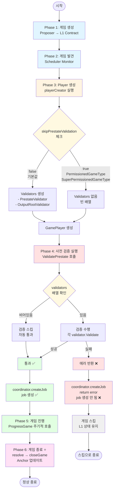

# Optimism Challenger 검증 시스템 완벽 해부

## 동영상 개요
- **제목**: "Optimism Challenger: 게임 발견부터 Anchor 업데이트까지 완벽 가이드"
- **길이**: 약 23-24분 (DEFENDER_WINS vs CHALLENGER_WINS 비교 포함)
- **대상**: Optimism 개발자, 블록체인 엔지니어, 시스템 관리자
- **목표**:
  - Challenger의 전체 동작 플로우를 Phase 1~6까지 완벽 이해
  - closeGame()의 critical한 중요성 깨닫기
  - DEFENDER_WINS vs CHALLENGER_WINS의 차이와 재제출 프로세스 이해
  - Progressive Anchoring과 Self-Healing System 개념 파악

---

## 파트 1: 인트로 및 등장인물 소개 (0:00-3:30)

### 장면 1: 오프닝 (0:00-0:30)

**내레이션**:
"안녕하세요! 오늘은 Optimism Challenger 시스템의 전체 동작 과정을 처음부터 끝까지 완벽하게 파헤쳐보겠습니다. 새로운 Dispute Game이 생성되는 순간부터 Challenger가 어떻게 게임을 발견하고, 검증하고, 참여하는지 모든 단계를 따라가보죠."

**화면**:
- Optimism 로고 애니메이션
- "Challenger End-to-End Journey" 타이틀
- 전체 시스템 개요 이미지

---

### 장면 2: 등장인물 소개 - 시스템 아키텍처 (0:30-2:00)

**내레이션**:
"본격적으로 시작하기 전에, 이 시스템에 등장하는 주요 컴포넌트들을 먼저 소개하겠습니다. 마치 영화의 등장인물처럼, 각자의 역할이 명확히 나뉘어 있습니다."

**화면**:
- 3계층 아키텍처 다이어그램 (L1 / Off-Chain / L2)

```
┌─────────────────────────────────────────────────────────────┐
│                         L1 (Ethereum)                        │
├─────────────────────────────────────────────────────────────┤
│                                                               │
│  📜 DisputeGameFactory                                       │
│  └─ 역할: 새로운 Dispute Game 생성                          │
│  └─ Proposer가 여기에 트랜잭션 제출                         │
│                                                               │
│  📜 FaultDisputeGame (여러 개)                               │
│  └─ 역할: 개별 게임 상태 관리                                │
│  └─ Root claim, claims, counters 저장                        │
│  └─ 상태: IN_PROGRESS → DEFENDER_WINS / CHALLENGER_WINS     │
│                                                               │
│  📜 AnchorStateRegistry                                      │
│  └─ 역할: 게임 시작점(anchor) 관리                          │
│  └─ anchorGame: 최근 완료된 게임 참조                       │
│  └─ Cold Starting 문제의 근원                                │
│                                                               │
└─────────────────────────────────────────────────────────────┘

┌─────────────────────────────────────────────────────────────┐
│                      Off-Chain (Actors)                      │
├─────────────────────────────────────────────────────────────┤
│                                                               │
│  👤 Proposer                                                 │
│  └─ 역할: L2 output root 제안 (Root claim 제출)             │
│  └─ "Block 200의 상태는 0xdef456...입니다"                  │
│                                                               │
│  🛡️ Challenger                                               │
│  └─ 역할: Proposer의 주장 검증 및 반박                      │
│  └─ 구성:                                                    │
│     ├─ Scheduler: L1 모니터링, 새 게임 발견                 │
│     ├─ Coordinator: Player 생성 및 검증 조율                │
│     ├─ GamePlayer: 실제 게임 참여 로직                      │
│     ├─ Validator: 사전 검증 (게임 참여 가능 여부)           │
│     └─ Agent: 게임 진행 중 액션 실행                        │
│                                                               │
│  📁 Fileserver                                               │
│  └─ 역할: VM prestate 파일 제공                             │
│  └─ 0x03a1a135....bin.gz 등                                 │
│                                                               │
└─────────────────────────────────────────────────────────────┘

┌─────────────────────────────────────────────────────────────┐
│                      L2 (Optimism Chain)                     │
├─────────────────────────────────────────────────────────────┤
│                                                               │
│  🌐 L2 Node (Archive Mode)                                   │
│  └─ 역할: 모든 과거 블록 상태 제공                          │
│  └─ API: rollupClient.OutputAtBlock(blockNumber)            │
│  └─ Example: Block 500일 때 Block 100 조회 가능             │
│                                                               │
└─────────────────────────────────────────────────────────────┘
```

**핵심 설명**:

**L1 Contract들**:
- **DisputeGameFactory**: 게임 생성 공장. Proposer가 새 게임을 만드는 곳
- **FaultDisputeGame**: 개별 게임 인스턴스. 상태와 claim들을 저장
- **AnchorStateRegistry**: 게임 시작점을 관리. Cold Starting 문제와 연관

**Off-Chain 참여자**:
- **Proposer**: "이 블록의 상태는 이렇습니다"라고 주장하는 쪽
- **Challenger**: "그게 틀렸습니다"라고 검증하고 반박하는 쪽 (우리의 주인공!)
  - Scheduler: 감시자
  - Coordinator: 조율자
  - Validator: 사전 검사관
  - GamePlayer + Agent: 실제 전투원

**L2 시스템**:
- **L2 Archive Node**: 과거 블록 데이터를 제공하는 진실의 원천

**상호작용**:
```
1. Proposer → L1 Contract
   └─ 게임 생성

2. Challenger.Scheduler → L1 Contract
   └─ 게임 발견

3. Challenger.Validator → L2 Node + Fileserver
   └─ 사전 검증

4. Challenger.Agent → L1 Contract
   └─ Counter claim 제출

5. 모든 검증 → L2 Node
   └─ 진실 확인
```

---

### 장면 3: Challenger의 생명주기 - 큰 그림 (2:00-3:30)

**내레이션**:
"Challenger의 동작은 크게 6단계로 나뉩니다. 첫째, Proposer가 L1에 새로운 게임을 생성합니다. 둘째, Scheduler가 이 게임을 발견합니다. 셋째, playerCreator가 Validators와 GamePlayer를 생성합니다. 넷째, ValidatePrestate가 실행되어 실제 검증을 수행합니다. 중요한 점은, 이 검증에 실패해도 L1 Contract의 게임 상태는 변하지 않습니다. 다섯째, 검증을 통과하면 ProgressGame이 주기적으로 호출되어 모든 claim을 검증하고 반박합니다. 마지막으로 여섯째, 게임이 종료되면 resolve와 closeGame을 통해 AnchorStateRegistry를 업데이트합니다."

**화면**:
- 전체 플로우 다이어그램 (6단계)
```
Phase 1: 게임 생성 (Proposer → L1 Contract)
    ↓
Phase 2: 게임 발견 (Scheduler Monitor)
    ↓
Phase 3: Player 생성 (playerCreator → Validators + GamePlayer)
    ↓
Phase 4: 사전 검증 실행 (ValidatePrestate)
    ↓
Phase 5: 게임 진행 (ProgressGame 주기적 호출)
    ↓
Phase 6: 게임 종료 및 Anchor 업데이트 (resolve → closeGame) ⭐

┌─────────────────────────────────────────────────────────────────────┐
│                             시작                                     │
└────────────────────────────┬────────────────────────────────────────┘
                             ↓
┌─────────────────────────────────────────────────────────────────────┐
│  Phase 1: 게임 생성                                                  │
│  Proposer → L1 Contract                                             │
└────────────────────────────┬────────────────────────────────────────┘
                             ↓
┌─────────────────────────────────────────────────────────────────────┐
│  Phase 2: 게임 발견                                                  │
│  Scheduler Monitor                                                  │
└────────────────────────────┬────────────────────────────────────────┘
                             ↓
┌─────────────────────────────────────────────────────────────────────┐
│  Phase 3: Player 생성                                                │
│  playerCreator 실행 🔍                                               │
│                                                                     │
│  ┌─────────────────────────────────────┐                           │
│  │ skipPrestateValidation 체크 ⚙️       │                           │
│  └────────┬───────────────┬────────────┘                           │
│        false│              │true                                    │
│     (기본값)│              │(Permissioned)                          │
│            ↓              ↓                                         │
│  [Validators 생성]  [Validators 없음]                               │
│  - PrestateValidator     (빈 배열)                                  │
│  - OutputRootValidator                                              │
│            │              │                                         │
│  ──────────┴──────────────┴────────────                             │
│  GamePlayer 생성 (validators 포함)                                   │
└────────────────────────────┬────────────────────────────────────────┘
                             ↓
┌─────────────────────────────────────────────────────────────────────┐
│  Phase 4: 사전 검증 실행                                             │
│  ValidatePrestate() 호출                                            │
│                                                                     │
│  ┌──────────────────────────────┐                                  │
│  │ validators 배열 순회 실행     │                                  │
│  └────────┬──────────┬──────────┘                                  │
│        비어있음│      │있음                                          │
│            ↓         ↓                                              │
│      [검증 스킵]  [검증 수행]                                        │
│       자동 통과   ├─성공 → 통과                                      │
│                  └─실패 → 에러 반환                                 │
└────────────┬──────────┬──────────────────────────────────────────┘
             │          │
          ✅통과      ❌실패
             │          │
             │          ↓
             │     ┌──────────────────────────────┐
             │     │ coordinator.createJob():      │
             │     │ return error                  │
             │     │ → job 생성 안 됨!             │
             │     └──────────┬───────────────────┘
             │                │
             │                ↓
             │           ┌─────────────┐
             │           │ 게임 스킵 ❌ │
             │           │ L1 상태 유지 │
             │           └──────┬──────┘
             │                  │
             │                  └──────────────┐
             ↓                                 │
    ┌────────────────────────┐                 │
    │ coordinator.createJob():│                 │
    │ return job ✅           │                 │
    └────────┬───────────────┘                 │
             ↓                                  │
    ┌────────────────────────┐                 │
    │ Phase 5: 게임 진행      │                 │
    │ ProgressGame 주기적 호출│                 │
    └────────┬───────────────┘                 │
             ↓                                  │
    ┌─────────────────────────────┐            │
    │ Phase 6: 게임 종료 ⭐        │            │
    │ resolve → closeGame         │            │
    │ Anchor 업데이트             │            │
    └────────┬────────────────────┘            │
             ↓                                  ↓
        [ 정상 종료 ] ◄──────────────────[ 스킵으로 종료 ]
```

**Mermaid 버전:**



⚙️  코드 위치 및 동작:
├─ register_task.go (Line 33-35)
│  └─ RegisterTask 구조체에 skipPrestateValidation 필드 정의
│
├─ register_task.go (Line 58, 97, 200)
│  └─ 각 RegisterTask 생성 함수에서 플래그 설정
│     ├─ NewCannonRegisterTask (Line 97):
│     │  skipPrestateValidation = (gameType == PermissionedGameType)
│     ├─ NewSuperCannonRegisterTask (Line 58):
│     │  skipPrestateValidation = (gameType == SuperPermissionedGameType)
│     ├─ NewSuperAsteriscKonaRegisterTask (Line 200):
│     │  skipPrestateValidation = (gameType == SuperPermissionedGameType)
│     └─ NewAsteriscRegisterTask, NewAsteriscKonaRegisterTask:
│        skipPrestateValidation 설정 안 함 (기본값 false)
│
├─ register_task.go (Line 336-339)
│  └─ playerCreator 함수 내부에서 skipPrestateValidation 체크
│     ├─ false (기본값): validators 배열 생성 (PrestateValidator, OutputRootValidator)
│     └─ true: validators = [] (빈 배열)
│
├─ player.go (Line 161, 165-172)
│  └─ GamePlayer 생성 시 validators 전달
│     └─ ValidatePrestate() 메서드에서 validators 순회 실행
│        ├─ validators가 비어있으면 → 검증 없이 자동 통과
│        └─ validators가 있으면 → 각 validator의 Validate() 실행
│
└─ validator.go (Line 36-50)
   └─ PrestateValidator.Validate()
      ├─ L1 Contract의 prestate hash 가져오기
      ├─ Local provider의 prestate hash 가져오기
      └─ 두 값이 일치하는지 비교 (불일치 시 에러)

📌 핵심 차이점:
├─ skipPrestateValidation = false (기본값, Permissionless 게임)
│  ├─ 적용 게임: CannonGameType, AsteriscGameType, AsteriscKonaGameType 등
│  ├─ Phase 3: Validators 생성됨 ✅
│  └─ Phase 4: 실제 검증 수행 → 실패 시 게임 스킵
│
└─ skipPrestateValidation = true (Permissioned 게임)
   ├─ 적용 게임: PermissionedGameType (1), SuperPermissionedGameType (5)
   ├─ Phase 3: Validators 생성 안 됨 ❌
   ├─ Phase 4: ValidatePrestate() 호출되지만 빈 배열이라 자동 통과
   └─ 이유: 신뢰된 참가자 전용, 유효한 prestate 없이 구성 가능
```

**핵심 포인트**:
- Phase 3에서 Validator와 GamePlayer가 함께 생성되지만 아직 검증 안 함
- Phase 4에서 ValidatePrestate()가 실행되어 실제 검증 수행
- 검증은 두 단계로 나뉨: 사전 검증(Phase 4) vs 게임 중 검증(Phase 5)

**게임 상태**:
```
L1 Contract 게임 상태:
├─ Phase 1 (게임 생성): IN_PROGRESS ✅
├─ Phase 4 (검증 실패): IN_PROGRESS ✅ (변화 없음!)
└─ Phase 5 (게임 진행): IN_PROGRESS ✅

⚠️ ValidatePrestate 실패해도:
   - L1 Contract 상태는 변경되지 않음
   - 이 Challenger만 로컬에서 게임 스킵
   - 다른 Challenger들은 여전히 참여 가능
   - 게임은 L1에 그대로 존재
```

---

## 파트 2: Phase 1-2 게임 생성과 발견 (3:30-5:30)

### 장면 4: Phase 1 - Proposer가 게임 생성 (3:30-4:30)

**내레이션**:
"모든 것은 Proposer가 DisputeGameFactory에 새로운 게임을 생성하면서 시작됩니다. Proposer는 특정 L2 블록의 output root를 제안하고, 이것이 맞다고 주장하는 claim을 제출합니다."

**화면**:
- L1 블록체인 애니메이션
- DisputeGameFactory.create() 호출 시각화
- 게임 초기화 과정

**코드 플로우**:
```
T=0: Proposer 트랜잭션
├─ DisputeGameFactory.create()
│  ├─ gameType: 0 (CANNON)
│  ├─ rootClaim: 0xdef456... (Block 200 주장)
│  └─ extraData: Block 200
├─ FaultDisputeGame 생성
└─ AnchorStateRegistry.getAnchorRoot() 호출
   ├─ anchorGame 확인
   └─ startingOutputRoot 설정
      ├─ Cold: 0xdead... (잘못된 값) ❌
      └─ Warm: 0xabc123... (유효한 값) ✅
```

**중요 포인트**:
- 게임 생성 시 **snapshot**이 중요
- AnchorStateRegistry의 상태가 게임에 고정됨
- Cold Starting vs Warm 상태 결정

---

### 장면 5: Phase 2 - Challenger가 게임 발견 (4:30-5:30)

**내레이션**:
"Challenger는 L1 블록체인을 지속적으로 모니터링합니다. Scheduler가 새로운 게임을 감지하면 즉시 반응하지만, 바로 참여하지는 않습니다. 먼저 이 게임이 참여할 가치가 있는지 검증해야 합니다."

**화면**:
- Scheduler 모니터링 애니메이션
- 새 게임 이벤트 감지
- GamePlayer 생성 트리거

**코드 플로우**:
```
T=5분: Challenger 발견
├─ Scheduler: "New game detected 0xGame123..."
├─ Event listener: GameCreated
└─ playerCreator() 함수 트리거
   └─ 다음 단계: 사전 검증
```

---

## 파트 3: Phase 3 - Player 생성 단계 (5:30-11:30)

### 장면 6: Player 생성 개요 및 준비 (5:30-6:30)

**내레이션**:
"이제 핵심 단계입니다. Scheduler가 createPlayer를 호출하면 playerCreator 함수가 실행됩니다. 이 함수는 Contract 정보를 조회하고, 두 개의 Validator를 생성하며, 최종적으로 GamePlayer 객체를 만듭니다. 중요한 점은 이 단계에서는 Validator를 생성만 하고 아직 검증을 실행하지는 않는다는 것입니다."

**화면**:
- 검증 준비 단계 다이어그램
- Contract 정보 조회
- Validator 생성 과정

**단계**:
```
coordinator.createPlayer() 호출:
  └─ playerCreator() 실행 (register_task.go:292-340)

     1. Contract 연결
        └─ FaultDisputeGameContract 생성

     2. Contract에서 정보 조회
        ├─ GetAbsolutePrestateHash()
        │  → 0x03a1a135...
        ├─ GetGameRange()
        │  → prestateBlock = 100
        │  → poststateBlock = 200
        └─ GetStartingRootHash()
           → 0xdead... (Cold) or 0xabc123... (Warm)

     3. Provider 생성
        ├─ vmPrestateProvider (파일서버용)
        └─ prestateProvider (L2 RPC용)

     4. Validator 생성 (Line 335-339)
        ├─ Validator 1: VM Prestate
        └─ Validator 2: Output Root
        ⚠️ 주의: 생성만 하고 아직 실행 안 함!

     5. NewGamePlayer() 호출 (Line 340)
        └─ GamePlayer 반환 (validators 포함)
```

---

### 장면 7: skipPrestateValidation 플래그 (6:30-7:30)

**내레이션**:
"잠깐, 모든 게임이 검증을 거치는 건 아닙니다. skipPrestateValidation 플래그가 true면 검증을 건너뜁니다. 이는 신뢰할 수 있는 참여자만 있는 Permissioned 게임에서 사용됩니다. 이러한 게임들은 step() 호출에 도달할 것으로 예상되지 않으며, 종종 유효한 prestate 없이 구성되는 경우가 많지만, Challenger는 여전히 게임을 해결해야 합니다."

**화면**:
- 게임 타입별 분기
- 플래그 결정 로직

**코드**:
```go
// register_task.go:94-97 (실제 코드 주석)
// Don't validate the absolute prestate or genesis output root for permissioned games
// Only trusted actors participate in these games so they aren't expected to reach
// the step() call and are often configured without valid prestates but the
// challenger should still resolve the games.

// register_task.go:336
if !e.skipPrestateValidation {
    validators = append(validators, ...)
} else {
    // 검증 없이 바로 게임 참여!
}

// 플래그 설정 (각 RegisterTask 함수별)
NewCannonRegisterTask:
  skipPrestateValidation = (gameType == PermissionedGameType)  // GameType = 1

NewSuperCannonRegisterTask:
  skipPrestateValidation = (gameType == SuperPermissionedGameType)  // GameType = 5

NewSuperAsteriscKonaRegisterTask:
  skipPrestateValidation = (gameType == SuperPermissionedGameType)  // GameType = 5

NewAsteriscRegisterTask, NewAsteriscKonaRegisterTask:
  skipPrestateValidation = false (기본값, 설정 안 함)
```

**핵심 이유 (코드 주석 기반):**
- Permissioned 게임은 **신뢰된 참여자(trusted actors)만** 참여
- step() 호출에 도달할 것으로 예상되지 않음
- 종종 **유효한 prestate 없이 구성됨**
- 하지만 Challenger는 여전히 **게임을 resolve해야 함**

---

### 장면 8: Validator 1 - VM Prestate 검증 상세 (7:30-9:00)

**내레이션**:
"첫 번째 Validator는 VM의 absolutePrestate를 검증합니다. 이는 Cannon VM의 초기 메모리 상태, 레지스터 값, 프로그램 카운터 등 모든 초기 상태의 해시입니다. 이것이 Fault Proof의 시작점을 정의합니다."

**화면**:
- VM 메모리 구조 다이어그램
- 파일서버 통신 애니메이션
- 해시 비교 프로세스

**검증 단계**:
```
Step 1: Contract 값 조회
└─ contract.GetAbsolutePrestateHash()
   → 0x03a1a135...

Step 2: Provider 값 계산
├─ 로컬 캐시 확인
│  ~/datadir/0x03a1a135....bin.gz
│  └─ 있으면 사용 ✅
│  └─ 없으면 다음 단계
├─ 파일서버 다운로드
│  GET http://fileserver/0x03a1a135....bin.gz
│  └─ 우선순위: .bin.gz → .json.gz → .json
└─ 해시 계산
   → 0x03a1a135...

Step 3: 비교
Contract: 0x03a1a135...
Provider: 0x03a1a135...
→ ✅ PASS (보통 성공)
```

**왜 중요한가?**:
- Trace Bisection의 기준점
- 모든 challenger가 동일한 VM 시작 상태 보장
- 잘못되면 부정직한 증명 가능

---

### 장면 9: Validator 2 - Starting Output Root 검증 상세 (9:00-11:00)

**내레이션**:
"두 번째 Validator는 더 복잡합니다. 게임의 starting block output root를 검증하는데, 여기서 핵심은 L2 RPC를 통한 과거 블록 조회입니다. 현재 L2가 Block 500에 있어도 Block 100의 데이터를 조회할 수 있습니다. 이것이 Archive Node의 힘입니다."

**화면**:
- L2 블록체인 타임라인
- 과거 블록 조회 메커니즘
- Archive Node 역할 설명

**검증 단계**:
```
Step 1: Contract에서 블록 정보
├─ prestateBlock = 100
└─ startingRootHash
   ├─ Cold: 0xdead... ❌
   └─ Warm: 0xabc123... ✅

Step 2: PrestateProvider 생성
└─ NewPrestateProvider(rollupClient, 100)
   → prestateBlock = 100 저장

Step 3: L2 RPC 호출 (핵심!)
├─ prestateProvider.AbsolutePreStateCommitment()
└─ rollupClient.OutputAtBlock(ctx, 100)
   ├─ 현재 L2 = Block 500
   ├─ 요청: Block 100 (400 블록 전!)
   └─ Archive Node: 과거 데이터 반환
      → 0xabc123...

Step 4: 비교
Cold Starting:
  Contract: 0xdead...
  Provider: 0xabc123...
  → ❌ FAIL → 게임 스킵

Warm 상태:
  Contract: 0xabc123...
  Provider: 0xabc123...
  → ✅ PASS → 게임 참여
```

**과거 블록 조회가 가능한 이유**:
- 블록체인의 불변성
- Archive Node가 모든 과거 상태 저장
- 시간 독립적 검증 가능

---

### 장면 9: Cold Starting 문제 심층 분석 (9:30-10:30)

**내레이션**:
"Cold Starting은 AnchorStateRegistry가 처음 배포될 때 발생합니다. anchorGame이 address(0)이면 startingAnchorRoot를 사용하는데, 이것이 0xdead로 시작하는 placeholder 값입니다. 이 상태에서 생성된 모든 게임은 검증에 실패합니다."

**화면**:
- AnchorStateRegistry 상태 다이어그램
- Cold vs Warm 비교
- 문제 발생 시나리오

**시나리오**:
```
═══════ Cold Starting 상태 ═══════

AnchorStateRegistry:
├─ anchorGame = address(0) ❌
└─ startingAnchorRoot = 0xdead...

Game 생성 시:
└─ getAnchorRoot()
   └─ anchorGame == address(0)?
      └─ YES → 0xdead... 반환 ❌

Validator 2 검증:
├─ Contract: 0xdead... ❌
├─ Provider: 0xabc123... ✅ (실제 값)
└─ 비교 → FAIL ❌

결과:
└─ 모든 게임 스킵
   └─ "output root absolute prestate does not match"

═══════ Warm 상태 (해결 후) ═══════

AnchorStateRegistry:
├─ anchorGame = 0xGame1... ✅
└─ 유효한 게임 참조

Game 생성 시:
└─ getAnchorRoot()
   └─ anchorGame.rootClaim() ✅

Validator 2 검증:
├─ Contract: 0xabc123... ✅
├─ Provider: 0xabc123... ✅
└─ 비교 → PASS ✅

결과:
└─ 게임 참여 가능 ✅
```

**해결 방법 (중요!)**:
```bash
# 완전한 3단계 프로세스
1. resolve() - 첫 게임 완료
2. 대기 - finality delay 경과
3. closeGame() - anchorGame 업데이트 ← 핵심!
```

---

## 파트 4: Phase 4 - 사전 검증 실행 (12:00-13:30)

### 장면 11: ValidatePrestate() 실행 (12:00-13:00)

**내레이션**:
"GamePlayer가 생성되었습니다. 이제 coordinator가 player.ValidatePrestate를 호출합니다. 이 함수가 Phase 3에서 생성된 두 Validator를 실제로 실행하는 순간입니다. 두 검증을 순차적으로 수행하며, 하나라도 실패하면 즉시 중단되고 게임을 스킵합니다."

**화면**:
- ValidatePrestate 함수 실행
- 순차적 검증 과정
- 성공/실패 분기

**실제 호출 위치**:
```go
// coordinator.go:133-143
if state.player == nil {
    // 1. Player 생성 (Phase 3)
    player, err := c.createPlayer(game, c.disk.DirForGame(game.Proxy))
    if err != nil {
        return nil, fmt.Errorf("failed to create game player: %w", err)
    }

    // 2. 🔥 검증 실행 (Phase 4 - 지금!)
    if err := player.ValidatePrestate(ctx); err != nil {
        if !c.allowInvalidPrestate || !errors.Is(err, types.ErrInvalidPrestate) {
            return nil, fmt.Errorf("failed to validate prestate: %w", err)
        }
        c.logger.Error("Invalid prestate", "game", game.Proxy, "err", err)
    }

    state.player = player
}
```

**ValidatePrestate 내부**:
```go
// player.go:165-171
func (g *GamePlayer) ValidatePrestate(ctx context.Context) error {
    for _, validator := range g.prestateValidators {
        if err := validator.Validate(ctx); err != nil {
            return err  // 즉시 실패!
        }
    }
    return nil  // 모두 통과!
}
```

**검증 순서**:
```
1. Validator 1 실행 (VM Prestate)
   ├─ contract.GetAbsolutePrestateHash() 호출
   ├─ vmPrestateProvider.AbsolutePreStateCommitment() 호출
   └─ PASS → 다음으로 / FAIL → 게임 스킵 ❌

2. Validator 2 실행 (Output Root)
   ├─ contract.GetStartingRootHash() 호출
   ├─ prestateProvider.AbsolutePreStateCommitment() 호출
   │  └─ rollupClient.OutputAtBlock(prestateBlock) 🔥
   └─ PASS → Phase 5로 ✅ / FAIL → 게임 스킵 ❌
```

**검증 실패 시 상태 변화**:
```
검증 실패 (Cold Starting 등):
├─ L1 Contract 상태: IN_PROGRESS ✅ (변화 없음!)
├─ coordinator 처리:
│  ├─ return nil, error
│  ├─ state.player = nil 유지
│  └─ job 생성 안 됨
├─ 이 Challenger: 게임 스킵
└─ 다른 노드들: 독립적으로 참여 가능

검증 성공:
├─ L1 Contract 상태: IN_PROGRESS ✅ (동일)
├─ coordinator 처리:
│  ├─ state.player에 저장
│  └─ newJob(player) 생성
└─ 이 Challenger: Phase 5로 진행
```

---

## 파트 5: Phase 5 - 게임 진행 (13:30-17:00)

### 장면 12: GamePlayer 구조 리캡 (13:30-14:00)

**내레이션**:
"검증을 통과했습니다! 이미 Phase 3에서 생성된 GamePlayer의 내부 구조를 다시 살펴보죠. TraceAccessor, Agent, Responder 등 게임에 필요한 모든 컴포넌트가 이미 초기화되어 있습니다. 이제 이 Player가 실제로 게임을 진행할 준비가 완료되었습니다."

**화면**:
- GamePlayer 컴포넌트 다이어그램
- 각 컴포넌트 역할 설명
- 연결 관계

**GamePlayer 구조 (Phase 3에서 이미 생성됨)**:
```
NewGamePlayer() 생성 (player.go:88-162):

1. TraceAccessor 생성 (중요!)
   ├─ OutputTraceProvider
   │  └─ 이것이 TraceProvider.Get() 제공
   └─ 게임 중 블록 검증에 사용

2. Oracle & Preimage Uploader
   ├─ DirectPreimageUploader (작은 데이터용)
   ├─ LargePreimageUploader (큰 데이터용)
   └─ SplitPreimageUploader (자동 선택)

   역할: step() 실행 전 preimage를 L1에 업로드
   (상세 설명은 장면 14-2 참조)

3. Responder 생성
   └─ FaultResponder
      └─ Claim 제출 담당

4. Agent 생성 (핵심!)
   ├─ accessor (TraceProvider)
   ├─ responder (Claim 제출기)
   └─ solver (액션 계산)

5. GamePlayer 반환
   ├─ act: agent.Act  ← 실제 게임 로직
   ├─ prestateValidators
   └─ loader, logger 등
```

---

### 장면 13: ProgressGame() - 게임 진행 시작 (14:00-14:45)

**내레이션**:
"검증을 통과한 GamePlayer는 state에 저장되고, coordinator가 job을 생성합니다. 이제 worker가 이 job을 받아 ProgressGame을 주기적으로 호출합니다. 이 함수가 agent.Act를 실행하며, 실제 게임 로직이 시작됩니다."

**화면**:
- 주기적 호출 애니메이션
- ProgressGame 플로우
- agent.Act 트리거

**전체 플로우**:
```
coordinator.createJob():
  ├─ createPlayer() (Phase 3)
  ├─ ValidatePrestate() (Phase 4)
  └─ newJob(player) 생성
     └─ job을 queue에 추가

worker:
  └─ job 받아서 처리
     └─ player.ProgressGame() 호출 🔥
```

**ProgressGame 코드**:
```go
// player.go:178-207
func (g *GamePlayer) ProgressGame(ctx context.Context) GameStatus {
    // 게임 종료 확인
    if g.status != GameStatusInProgress {
        return g.status
    }

    // 동기화 확인
    if err := g.syncValidator.ValidateNodeSynced(ctx, g.gameL1Head); ... {
        return g.status
    }

    // 🔥 실제 게임 액션!
    if err := g.act(ctx); err != nil {
        g.logger.Error("Error when acting on game", "err", err)
    }
    // g.act = agent.Act (Phase 3에서 설정됨)

    // 상태 업데이트
    status, err := g.loader.GetStatus(ctx)
    g.status = status
    return status
}
```

---

### 장면 14: agent.Act() - 실제 게임 로직 (14:45-15:30)

**내레이션**:
"Agent.Act는 게임의 심장부입니다. 먼저 Contract에서 현재 게임 상태를 가져오고, Solver에게 다음 액션을 계산하도록 요청합니다. 이 과정에서 TraceProvider.Get이 호출되며, 모든 중간 블록들이 검증됩니다."

**화면**:
- agent.Act 실행 플로우
- Contract 조회
- Solver 액션 계산

**코드 플로우**:
```go
// agent.go:79-112
func (a *Agent) Act(ctx context.Context) error {
    // 1. Resolve 시도
    if a.tryResolve(ctx) {
        return nil
    }

    // 2. L2 block number challenge 확인
    if challenged, err := a.loader.IsL2BlockNumberChallenged(...); ... {
        return nil
    }

    // 3. 🔥 게임 상태 로드
    game, err := a.newGameFromContracts(ctx)
    // → 모든 claims 가져오기

    // 4. 🔥 액션 계산 (핵심!)
    actions, err := a.solver.CalculateNextActions(ctx, game)
    // → 여기서 모든 블록 검증!

    // 5. 🔥 액션 실행 (병렬)
    var wg sync.WaitGroup
    for _, action := range actions {
        go a.performAction(ctx, &wg, action)
    }
    wg.Wait()

    return nil
}
```

---

### 장면 14-2: solver.CalculateNextActions() - 액션 계산 (15:00-16:00)

**내레이션**:
"여기가 바로 마법이 일어나는 곳입니다. Solver는 게임의 모든 claim을 순회하며, 각 claim에 대해 먼저 shouldCounter로 대응 필요성을 판단합니다. Counter가 필요하면 agreeWithClaim으로 값을 비교하고, agree면 defend, disagree면 attack을 결정합니다. 이 과정에서 TraceProvider.Get이 여러 번 호출되며, 매번 L2 RPC를 통해 실제 블록 값을 조회합니다. 또한 우리가 만든 claim을 honestClaims에 추적하여, 다음 순회에서 불필요한 처리를 방지합니다."

**화면**:
- Bisection 과정 애니메이션
- TraceProvider.Get 호출 (여러 번)
- shouldCounter → agreeWithClaim → attack/defend 흐름
- honestClaims 추적 시각화
- 블록별 검증 시각화

**코드 위치**:
```
주요 파일:
├─ game/fault/solver/game_solver.go
│  ├─ Line 92-145: CalculateNextActions() - 전체 조율
│  ├─ Line 127-133: 모든 claim 순회 for loop
│  ├─ Line 169-187: calculateMove() - 중간 claim 처리
│  └─ Line 148-167: calculateStep() - leaf claim 처리
│
├─ game/fault/solver/solver.go
│  ├─ Line 30-61: shouldCounter() - 대응 필요성 판단
│  ├─ Line 64-82: NextMove() - 다음 move 계산
│  ├─ Line 95-133: AttemptStep() - step 액션 계산
│  ├─ Line 165-168: agreeWithClaim() - 값 비교
│  ├─ Line 136-146: attack() - Attack 액션 생성
│  └─ Line 149-162: defend() - Defend 액션 생성
│
└─ game/fault/solver/honest_claims.go
   ├─ Line 22-27: AddHonestClaim() - 우리 claim 추적
   └─ Line 29-31: IsHonest() - 정직한 claim 확인
```

**🌳 게임 트리 구조 (MaxDepth 개념)**:
```
MaxDepth = 73 (일반적인 값)

Depth 0: [Root Claim]                    ← 최상단 (Block 100-200)
           │
    ┌──────┴──────┐
Depth 1: [Claim] [Claim]                 ← 중간 노드 (Block 100-150 vs 150-200)
           │         │
    ┌──────┴──   ┌──┴──┐
Depth 2: [C] [C] [C] [C]                 ← 중간 노드 (계속 bisection)
           ...
           ...                            ← Depth 3, 4, 5... 72까지 계속
           ...
    ┌──────┴──────┐
Depth 73: [C] ... [C]                    ← Leaf nodes (최하단)
          ↑                               ← 단일 instruction 수준
          └─ claim.Depth() == game.MaxDepth()
             → calculateStep() 호출
             → step() 트랜잭션 생성 🔥

중간 노드 (Depth < 73):
├─ calculateMove() 사용
├─ attack()/defend() 호출
├─ ActionTypeMove 생성
└─ L1: attack() 또는 defend() 트랜잭션

Leaf 노드 (Depth == 73일 때만):
├─ calculateStep() 사용
├─ AttemptStep() 호출
├─ ActionTypeStep 생성
└─ L1: step() 트랜잭션 (PreState + Proof 포함)

⚠️ 핵심: step()은 MaxDepth에서만 호출됨!
├─ claim.Depth() == game.MaxDepth() 조건 필요
├─ 하지만 대부분 MaxDepth 이전에 게임 종료!
└─ Proposer가 counter 안 하면 더 이상 진행 안 함
   └─ 예: Depth 15에서 Proposer 포기
       → Chess clock 만료 → resolve()
       → MaxDepth 73까지 안 감!
```

**💡 MaxDepth = 73의 의미**:
```
2^73 = 9,444,732,965,739,290,427,392 ≈ 9.4 × 10^21
└─ Cannon VM이 처리할 수 있는 이론적 최대 instruction 수

MaxDepth = 73:
├─ 게임 트리의 "최대 깊이" (이론적 한계)
├─ 73번까지 bisection 가능
└─ ⚠️ 실제로는 훨씬 적게 사용됨!

실제 bisection 횟수 (트랜잭션 수):
├─ 정직한 Proposer: 0번 (참여 안 함) ✅
├─ 일반적인 분쟁: 10-20번 정도 ✅
├─ 복잡한 분쟁: 30-40번
└─ 최악의 경우: 최대 73번 (극히 드묾)

게임 종료 조건 (MaxDepth 도달 전):
├─ Proposer가 더 이상 counter 안 함
├─ Chess clock 만료
├─ 문제 지점 명확히 특정됨
└─ → 그 시점에서 게임 종료! (MaxDepth까지 안 감)

실제 게임 진행 예시:
┌─────────────────────────────────────────┐
│ 케이스 A: Depth 15에서 종료 (일반적)   │
├─────────────────────────────────────────┤
│ Depth 0: Root claim 틀림 → Attack       │
│ Depth 1-14: Bisection 계속 (14번 tx)   │
│ Depth 15: Challenger의 claim 제출      │
│ └─ Proposer가 counter 안 함 (경제적 판단)│
│    └─ 틀렸다는 걸 알았거나           │
│    └─ Bond 손실 위험 > 반박 비용      │
│                                         │
│ 결과:                                   │
│ ├─ 총 트랜잭션: 15번 ✅                 │
│ ├─ MaxDepth(73)까지 안 감 ✅            │
│ ├─ Chess clock 만료 → resolve()        │
│ └─ Challenger 승리! (CHALLENGER_WINS)  │
└─────────────────────────────────────────┘

┌─────────────────────────────────────────┐
│ 케이스 B: MaxDepth까지 진행 (극히 드묾)│
├─────────────────────────────────────────┤
│ Depth 0-72: Bisection 계속 (73번 tx)   │
│ Depth 73: MaxDepth 도달 ✅              │
│ └─ claim.Depth() == 73                 │
│    └─ calculateStep() 호출 🔥          │
│       └─ ActionTypeStep 생성           │
│          └─ step() 트랜잭션            │
│             └─ VM 실행 증명 제출       │
│                                         │
│ 결과:                                   │
│ ├─ 총 트랜잭션: 73번 + step 1번        │
│ ├─ MaxDepth에서 step() 실행 ✅         │
│ └─ L1 Contract가 VM 재현해서 최종 판정│
└─────────────────────────────────────────┘

비유: "엘리베이터"
├─ 73층 건물 (MaxDepth = 73)
├─ 보통: 10-20층에서 내림 (게임 종료)
└─ 극히 드물게: 73층 꼭대기까지
```

**⏱️ Chess Clock 메커니즘 - 게임 종료의 핵심**:
```
🎯 역할: 무한 게임 방지 & 공정한 시간 배분

동작 방식:
├─ 각 참여자에게 제한 시간 부여
│  ├─ Production: 3.5일 (302400초)
│  └─ Devnet: 20분 (1200초)
├─ Claim 제출하면 상대방의 clock 시작
├─ Counter하면 자신의 clock 시작
└─ Clock 만료 시 더 이상 counter 못함

값 설정 위치:
└─ L1 Contract 배포 시 설정
   └─ deploy-config/*.json
      ├─ faultGameMaxClockDuration: 302400 (Production)
      └─ faultGameMaxClockDuration: 1200 (Devnet)

코드 참조:
// game.go:119-127
func ChessClock(now time.Time, claim Claim, parent Claim) time.Duration {
    duration := now.Sub(claim.Clock.Timestamp)  // 현재까지 경과 시간
    if parent != (Claim{}) {
        duration = parent.Clock.Duration + duration  // 누적
    }
    return duration
}

// agent.go:191
if ChessClock(now, claim, parent) <= maxClockDuration {
    continue  // ← 아직 시간 안 지남
}
// 시간 지나면 resolve 가능!
```

**실제 시나리오 (Production 환경)**:
```
maxClockDuration = 3.5일 (302400초)

T=0일: Root Claim (Proposer)
       └─ Challenger의 clock 시작 ⏱️

T=0.5일: Challenger Attack 제출
         ├─ Challenger clock: 0.5일 사용
         └─ Proposer의 clock 시작 ⏱️

T=1일: Proposer Defend 제출
       ├─ Proposer clock: 0.5일 사용
       └─ Challenger clock 재시작 ⏱️

T=2일: Challenger Attack 제출 (Depth 15)
       ├─ Challenger clock: 총 1.5일 사용 (0.5일+1일)
       └─ Proposer의 clock 시작 ⏱️

T=2일~5.5일: Proposer가 counter 안 함 ❌
              └─ Proposer clock 계속 증가...
              └─ 0.5일, 1일, 2일, 3일, 3.5일... ⏰

T=5.5일: ⏰ Chess Clock 만료!
         ├─ ChessClock(now, claim) = 3.5일
         ├─ 3.5일 >= maxClockDuration (3.5일)
         ├─ Proposer가 더 이상 counter 못함
         └─ resolve() 호출 가능! ✅

결과:
├─ 총 Depth: 15 (MaxDepth 73 안 감)
├─ step() 없음
├─ Chess clock 만료로 종료
└─ Challenger 승리! (CHALLENGER_WINS)
```

**환경별 maxClockDuration 값**:
```
Production:
├─ maxClockDuration: 3.5일 (302400초)
├─ 게임 총 기간: 약 7일 (양쪽 합산)
└─ deploy-config/mainnet.json, hardhat.json

Devnet/Test:
├─ maxClockDuration: 20분 (1200초)
├─ 게임 총 기간: 약 40분 (양쪽 합산)
└─ deploy-config/getting-started.json

💡 참고:
└─ 각 참여자에게 3.5일씩 주어짐
   └─ Proposer: 3.5일 + Challenger: 3.5일
   └─ 최대 총 게임 기간: 약 7일
```

**게임 종료 조건 정리**:
```
① Chess Clock 만료 (가장 흔함) ✅
   ├─ 상대가 counter 안 함
   ├─ maxClockDuration 초과
   └─ 어느 depth에서든 종료 가능

② MaxDepth에서 step() 증명 (드묾)
   ├─ Depth 73까지 진행
   ├─ step() 트랜잭션 제출
   └─ VM 실행으로 최종 판정

③ CounteredBy 확인
   ├─ claim.CounteredBy != address(0)
   ├─ 이미 counter된 claim
   └─ 더 이상 처리 불필요

대부분 ①번 방식으로 종료!
└─ 경제적 합리성: 틀린 걸 알면 포기
```

**💡 핵심 요약:**
- **MaxDepth까지 안 가도 됨**
- **Chess Clock 만료**로 종료 (가장 흔함)
- **step() 없이도 게임 종료** 가능
- 효율적이고 경제적인 설계

---

### 장면 14-3: solver 실제 동작 흐름 요약

**검증 프로세스 (간략)**:
```
for _, claim := range game.Claims() {
  Step 1: shouldCounter() 체크
  └─ 대응 필요한 claim만 선택

  Step 2: agreeWithClaim()
  └─ TraceProvider.Get() → L2 RPC 호출

  Step 3: attack() 또는 defend()
  └─ 새로운 position 계산 및 값 조회

  Step 4: Action 생성
  └─ honestClaims 추적 & 액션 반환
}

return actions  // ← 다음: performAction()으로 전달
```

**코드 위치**:
```
주요 파일:
├─ game/fault/solver/game_solver.go
│  ├─ Line 92-145: CalculateNextActions() - 전체 조율
│  ├─ Line 127-133: 모든 claim 순회 for loop
│  ├─ Line 169-187: calculateMove() - 중간 claim 처리
│  └─ Line 148-167: calculateStep() - leaf claim 처리
│
├─ game/fault/solver/solver.go
│  ├─ Line 30-61: shouldCounter() - 대응 필요성 판단
│  ├─ Line 64-82: NextMove() - 다음 move 계산
│  ├─ Line 95-133: AttemptStep() - step 액션 계산
│  ├─ Line 165-168: agreeWithClaim() - 값 비교
│  ├─ Line 136-146: attack() - Attack 액션 생성
│  └─ Line 149-162: defend() - Defend 액션 생성
│
└─ game/fault/solver/honest_claims.go
   ├─ Line 22-27: AddHonestClaim() - 우리 claim 추적
   └─ Line 29-31: IsHonest() - 정직한 claim 확인
```

**검증 프로세스 (전체 흐름)**:
```
═══════════════════════════════════════════════════════
Phase 1: 초기화
═══════════════════════════════════════════════════════

solver.CalculateNextActions(game):
├─ agreeWithRootClaim 판단
├─ honestClaims tracker 초기화
└─ Root claim이 정직하면 honestClaims에 추가

═══════════════════════════════════════════════════════
Phase 2: 모든 Claim 순회
═══════════════════════════════════════════════════════

for _, claim := range game.Claims() {  // ← 게임의 모든 claim!

  Step 1: Claim 타입 판단
  ├─ claim.Depth() == MaxDepth?
  │  ├─ Yes → calculateStep() 호출 (leaf node)
  │  └─ No → calculateMove() 호출 (중간 node)

  Step 2: shouldCounter() 체크 🔥
  ├─ honestClaims.IsHonest(claim)?
  │  └─ Yes → return false → 액션 없음 ✅ (우리가 만든 claim)
  │
  ├─ claim.IsRoot()?
  │  └─ Yes → return true (정직하지 않으면 항상 counter)
  │
  ├─ parent가 honest claim?
  │  └─ Yes → return true (정직한 claim 지키기)
  │
  ├─ parent에 honest counter 없음?
  │  └─ Yes → return false → 액션 없음 ✅ (무시)
  │
  └─ 전략적 판단 (trace index 비교)
     └─ return true/false

  ⚠️ shouldCounter = false → 이 claim 스킵! (다음 claim으로)

  Step 3: agreeWithClaim() 체크 🔥
  └─ ourValue = s.trace.Get(ctx, game, claim, claim.Position)
     ├─ 🔥 L2 RPC 호출!
     │  └─ rollupClient.OutputAtBlock(blockNumber)
     │     Example: OutputAtBlock(150)
     │
     └─ bytes.Equal(ourValue, claim.Value)
        ├─ true → agree ✅
        └─ false → disagree ❌

  Step 4: 액션 결정
  ├─ agree = true:
  │  ├─ claim.IsRoot()?
  │  │  ├─ Yes → return nil → 액션 없음 ✅
  │  │  └─ No → defend() 호출 🛡️
  │  │
  │  └─ defend():
  │     ├─ position = claim.Defend() (오른쪽 경로)
  │     ├─ value = s.trace.Get(ctx, game, claim, position)
  │     │  └─ 🔥 L2 RPC 호출! (defend position 값)
  │     └─ return Claim{ Position, Value }
  │
  └─ agree = false:
     └─ attack() 호출 ⚔️
        ├─ position = claim.Attack() (왼쪽 자식)
        ├─ value = s.trace.Get(ctx, game, claim, position)
        │  └─ 🔥 L2 RPC 호출! (attack position 값)
        └─ return Claim{ Position, Value }

  Step 5: 액션 생성 & honestClaims 추적
  ├─ honestClaims.AddHonestClaim(claim, move)
  │  └─ 우리가 만든 move를 추적 (다음 순회에서 스킵용)
  │
  ├─ game.IsDuplicate(move)?
  │  └─ Yes → 액션 없음 (중복)
  │
  └─ Action 생성:
     └─ Action{
          Type: ActionTypeMove,
          IsAttack: !game.DefendsParent(move),
          ParentClaim: claim,
          Value: move.Value,
        }
}

═══════════════════════════════════════════════════════
Phase 3: 모든 액션 반환
═══════════════════════════════════════════════════════

return actions  // ← agent.performAction()으로 전달

💡 핵심 포인트:
├─ TraceProvider.Get()이 여러 번 호출됨:
│  ├─ agreeWithClaim()에서 1회 (현재 position)
│  └─ attack()/defend()에서 1회 (새로운 position)
│  └─ 각 호출마다 L2 RPC (OutputAtBlock) 실행!
│
├─ honestClaims 추적이 중요:
│  ├─ 우리가 만든 claim을 기록
│  └─ 다음 순회에서 shouldCounter=false로 스킵
│  └─ 효율성 & 무한루프 방지
│
└─ 모든 claim 순회:
   ├─ 정직한 Proposer → 액션 거의 없음
   └─ 부정직한 Proposer → 여러 Attack/Defend 생성
```

**실제 시나리오 (상세)**:
```
Game: Block 100 → 200 검증

═══════════════════════════════════════════════════════
시나리오 A: 정직한 Proposer (가장 흔한 케이스)
═══════════════════════════════════════════════════════

초기화:
├─ agreeWithRootClaim 체크
│  ├─ ourValue = OutputAtBlock(200) → 0xAAA
│  ├─ rootClaim.Value = 0xAAA
│  └─ agree! → honestClaims에 Root 추가 ✅
└─ game.Claims() = [Claim0: Root]

Claim0 처리 (Root):
├─ calculateMove(Claim0)
├─ shouldCounter(Claim0) 🔥
│  └─ IsHonest(Claim0)? → Yes ✅
│  └─ return false
└─ 결과: 액션 없음 ✅

이후:
└─ 다른 claim들도 모두 정직하면 액션 없음
   └─ Challenger는 게임에 참여 안 함 (정직하니까!)

═══════════════════════════════════════════════════════
시나리오 B: 부정직한 Proposer - 전체 bisection
═══════════════════════════════════════════════════════

초기화:
├─ agreeWithRootClaim 체크
│  ├─ ourValue = OutputAtBlock(200) → 0xAAA
│  ├─ rootClaim.Value = 0xBAD
│  └─ disagree! ❌
└─ game.Claims() = [Claim0: Root]

────────────────────────────────────────────────────
Round 1: Claim0 처리 (Root)
────────────────────────────────────────────────────
├─ calculateMove(Claim0)
├─ shouldCounter(Claim0) 🔥
│  ├─ IsHonest? → No
│  ├─ IsRoot? → Yes
│  └─ return true ✅
│
├─ agreeWithClaim(Claim0) 🔥
│  ├─ ourValue = OutputAtBlock(200) → 0xAAA
│  ├─ claim.Value = 0xBAD
│  └─ return false ❌
│
├─ attack(Claim0) ⚔️
│  ├─ position = Claim0.Attack() (depth:1, index:0)
│  ├─ value = OutputAtBlock(150) → 0xCCC
│  └─ return Move{ Position(1,0), Value=0xCCC }
│
├─ honestClaims.AddHonestClaim(Claim0, Move)
│  └─ Move를 정직한 claim으로 추적
│
└─ Action 생성:
   └─ Action{ Type:Move, IsAttack:true, Value:0xCCC }

────────────────────────────────────────────────────
Challenger가 Action 실행 → L1에 Claim1 생성됨!
────────────────────────────────────────────────────

────────────────────────────────────────────────────
Round 2: game.Claims() = [Claim0, Claim1, Claim2(Proposer)]
────────────────────────────────────────────────────

Claim0 처리:
├─ shouldCounter(Claim0) → IsHonest? → No
└─ (위와 동일 - 이미 처리됨, IsDuplicate 체크로 스킵)

Claim1 처리 (우리가 만든 claim):
├─ shouldCounter(Claim1) 🔥
│  └─ IsHonest(Claim1)? → Yes ✅ (우리가 만듦)
│  └─ return false
└─ 액션 없음 ✅ (우리 claim은 counter 안 함)

Claim2 처리 (Proposer의 counter):
├─ shouldCounter(Claim2) 🔥
│  ├─ IsHonest? → No
│  ├─ Parent(Claim0)가 honest? → No
│  ├─ Claim0에 honest counter 있음? → Yes (Claim1)
│  └─ return true ✅
│
├─ agreeWithClaim(Claim2) 🔥
│  ├─ ourValue = OutputAtBlock(175) → 0xDDD
│  ├─ claim.Value = 0xDDD
│  └─ return true ✅
│
├─ defend(Claim2) 🛡️
│  ├─ position = Claim2.Defend()
│  ├─ value = OutputAtBlock(...) → 계산
│  └─ return Defend move
│
└─ Action 생성: Defend 액션

────────────────────────────────────────────────────
계속 bisection 진행...
────────────────────────────────────────────────────

Result:
├─ 각 claim마다 OutputAtBlock() 호출
├─ agree → Defend 🛡️ (정직한 claim 지지)
├─ disagree → Attack ⚔️ (부정직한 claim 반박)
└─ 모든 중간 블록이 검증됨!
```

**💡 핵심:**
- 모든 claim 검증 (L2 RPC 호출)
- 필요한 액션만 계산
- honestClaims 추적으로 효율성 확보

---

### 장면 15: performAction과 Preimage Uploader - 액션 실행 (16:00-16:45)

**내레이션**:
"Solver가 계산한 액션들은 agent.performAction을 통해 실행됩니다. 이 과정에서 중요한 것이 바로 Preimage Uploader입니다. step() 호출 전에 필요한 preimage 데이터를 L1 Contract에 업로드해야 합니다. 크기에 따라 DirectPreimageUploader 또는 LargePreimageUploader가 자동으로 선택됩니다. 모든 액션은 병렬로 실행되어 효율성을 극대화합니다."

**화면**:
- performAction → Responder.PerformAction 흐름
- Preimage 업로드 프로세스 (Direct vs Large)
- step() 실행 애니메이션
- 병렬 실행 시각화

**코드 위치**:
```
주요 파일:
├─ game/fault/agent.go
│  └─ Line 137-148: performAction() - 액션 실행 (병렬)
│
├─ game/fault/responder/responder.go
│  ├─ Line 90-129: PerformAction() - 액션 타입별 처리
│  ├─ Preimage 업로드 로직
│  └─ AttackTx/DefendTx/StepTx 호출
│
└─ game/fault/preimages/
   ├─ direct.go: DirectPreimageUploader
   ├─ large.go: LargePreimageUploader
   └─ split.go: SplitPreimageUploader (라우터)
```

**코드 플로우**:
```go
// agent.go:106-111 - 병렬 실행
var wg sync.WaitGroup
wg.Add(len(actions))
for _, action := range actions {
    go a.performAction(ctx, &wg, action)  // ← 병렬!
}
wg.Wait()

// agent.go:137-148
func (a *Agent) performAction(ctx context.Context, wg *sync.WaitGroup, action types.Action) {
    defer wg.Done()

    if err := a.responder.PerformAction(ctx, action); err != nil {
        a.log.Error("Failed to perform action", "err", err)
    }
}

// responder/responder.go:90-129
func (r *FaultResponder) PerformAction(ctx context.Context, action types.Action) error {
    // 1. Preimage 업로드 (step()용)
    if action.OracleData != nil {
        if !preimageExists {
            r.uploader.UploadPreimage(ctx, ...)
        }
    }

    // 2. 액션 타입별 실행
    switch action.Type {
    case ActionTypeMove:
        if action.IsAttack {
            candidate = r.contract.AttackTx(...)
        } else {
            candidate = r.contract.DefendTx(...)
        }
    case ActionTypeStep:
        candidate = r.contract.StepTx(...)
    case ActionTypeChallengeL2BlockNumber:
        candidate = r.contract.ChallengeL2BlockNumberTx(...)
    }

    return r.sender.SendAndWaitSimple("perform action", candidate)
}
```

**📋 3가지 Action Type 상세**:
```
① ActionTypeMove (중간 노드, Depth < MaxDepth)
├─ 용도: Bisection 진행 (문제 지점 좁히기)
├─ L1 함수:
│  ├─ IsAttack=true → attack(parentIndex, claim)
│  └─ IsAttack=false → defend(parentIndex, claim)
├─ 데이터: claim hash만 전송 (32 bytes)
└─ 비용: 낮음

② ActionTypeStep (Leaf 노드, Depth == MaxDepth)
├─ 용도: 단일 instruction 실행 증명
├─ L1 함수: step(claimIndex, isAttack, stateData, proof)
├─ 데이터:
│  ├─ PreState: VM의 전체 상태 (메모리, 레지스터 등)
│  ├─ ProofData: Merkle proof
│  └─ OracleData: Preimage (사전 업로드 필요!)
├─ 비용: 높음 (대량 데이터 + 실행)
└─ 증명: L1 Contract가 VM 실행 재현

③ ActionTypeChallengeL2BlockNumber (특수)
├─ 용도: L2 블록 번호가 invalid할 때
├─ L1 함수: challengeRootL2Block(outputRootProof, headerRlp)
├─ 조건: Proposer가 미래 블록 제안
└─ 예: L2 Safe Head=150인데 Block 200 제안
```

**📦 Preimage 업로드 메커니즘 상세**:
```
═══════════════════════════════════════════════════════
Preimage 타입별 업로드 방식
═══════════════════════════════════════════════════════

① Local Preimage (IsLocal = true)
├─ L1 Contract: FaultDisputeGame
├─ 함수: addLocalData(localContext, claimIndex, offset)
├─ 트랜잭션: 1개
├─ 특징: 게임별로 독립적 저장
├─ 예시: VM 실행 중 local 변수, 스택 데이터
└─ 코드: faultdisputegame.go:355-362

② Global Preimage (IsLocal = false)
├─ L1 Contract: PreimageOracle
├─ 함수 (key type에 따라):
│  ├─ loadKeccak256PreimagePart(offset, data)
│  ├─ loadSha256PreimagePart(offset, data)
│  ├─ loadBlobPreimagePart(zPoint, y, commitment, proof, offset)
│  └─ loadPrecompilePreimagePart(offset, addr, requiredGas, input)
├─ 특징: 모든 게임이 공유
├─ 예시: 블록 데이터, 트랜잭션 데이터
└─ 한 번 업로드하면 재사용 가능 ✅

═══════════════════════════════════════════════════════
크기별 업로드 전략
═══════════════════════════════════════════════════════

① DirectPreimageUploader (작은 데이터)
├─ 조건: size < threshold (보통 ~126KB)
├─ 방식: 1개 트랜잭션에 전체 데이터 포함
├─ 함수: UpdateOracleTx() 1번 호출
└─ 코드: preimages/direct.go:31-44

② LargePreimageUploader (큰 데이터)
├─ 조건: size >= threshold
├─ 방식: 여러 청크로 분할 (각 ~0.04MB)
├─ 3단계 프로세스:
│  1. InitLargePreimage(uuid, offset, size)
│  2. AddLeaves(uuid, blockIndex, data) ← 여러 번
│  3. Squeeze(uuid, stateMatrix, proofs)
└─ 코드: preimages/large.go:51-91

③ SplitPreimageUploader (자동 라우터)
├─ 역할: 크기에 따라 Direct/Large 자동 선택
├─ 로직:
│  if (IsLocal || size < threshold):
│     → DirectPreimageUploader
│  else:
│     → LargePreimageUploader
└─ 코드: preimages/split.go:23-33
```

**🔄 실제 업로드 흐름**:
```
Step 1: Responder.PerformAction(action)
        └─ action.OracleData 존재 확인

Step 2: Oracle 존재 여부 체크
        ├─ Local → 항상 업로드
        └─ Global → GlobalDataExists() 체크

Step 3: Uploader.UploadPreimage() 호출
        ├─ SplitPreimageUploader가 크기 판단
        │
        ├─ 작은 데이터:
        │  └─ UpdateOracleTx() → L1 트랜잭션 1개
        │     ├─ Local: FaultDisputeGame.addLocalData()
        │     └─ Global: PreimageOracle.loadKeccak256PreimagePart()
        │
        └─ 큰 데이터:
           └─ InitLargePreimage() → AddLeaves() × N → Squeeze()
              └─ L1 트랜잭션 N+2개

Step 4: step() 트랜잭션 실행
        └─ L1 Contract가 업로드된 preimage 읽어서 사용
```

**💡 핵심:**
- **Local vs Global**: 저장 위치 다름
- **Direct vs Large**: 크기에 따라 전략 다름
- **step() 전에 필수**: Preimage 없으면 step() 실패
- **재사용 가능**: Global은 한 번 업로드하면 모든 게임 사용

---

### 장면 16: Validator vs Game Logic - 역할 분리 (16:15-17:00) ⚠️ 삭제 가능

**내레이션**:
"이제 큰 그림이 보입니다. Validator는 '이 게임에 참여해도 되나?'라는 질문에 답하며, 단 1개 블록만 체크합니다. 반면 Game Logic은 '모든 주장이 맞나?'라는 질문에 답하며, 범위 내 모든 블록을 검증합니다. 이 두 단계가 결합되어 완벽한 보안을 제공합니다."

**화면**:
- 역할 분리 다이어그램
- 검증 범위 비교
- 효율성 vs 보안성

**비교표**:
```
┌──────────────────────────────────────────────────┐
│ Stage 1: Validator (게임 참여 전)                 │
└──────────────────────────────────────────────────┘

목적: 참여 조건 확인
검증: Block 100 (starting point만)
횟수: 1회
시점: 게임 발견 직후
실패 시: 게임 스킵

┌──────────────────────────────────────────────────┐
│ Stage 2: Game Logic (게임 진행 중)                │
└──────────────────────────────────────────────────┘

목적: 모든 주장 완전 검증
검증: Block 100~200 사이 모든 블록
      (100, 125, 137, 150, 162, 175, 187, 193, 200...)
횟수: 수십~수백 회 (bisection마다)
시점: 게임 진행 전체
실패 시: Counter claim 제출

결론: 둘 다 필수!
├─ Validator: 빠른 사전 체크
└─ Game Logic: 철저한 완전 검증
```

**왜 이렇게 설계했나?**:
```
효율성:
└─ Validator가 모든 블록 체크하면
   → 100개 블록 × 모든 게임
   → 너무 느림 ❌

현재 설계:
├─ Validator: 1개 블록 체크
│  └─ 빠른 참여 결정 ✅
└─ Game Logic: 필요한 것만
   └─ Bisection으로 효율적 ✅

보안성:
└─ 두 단계 모두 완벽히 검증
   → 문제 있으면 반드시 발견 ✅
```

---

## 파트 6: Phase 6 - 게임 종료 및 Anchor 업데이트 (17:00-20:00)

### 장면 16: 게임 종료 - resolve()와 그 한계 (17:00-17:45)

**내레이션**:
"7일간의 긴 게임이 끝났습니다. Challenger가 Proposer의 잘못된 주장을 성공적으로 반박했고, 모든 claim이 검증되었습니다. Agent가 자동으로 tryResolve를 호출하여 게임을 종료합니다. 하지만 여기서 중요한 진실! resolve()는 게임 상태만 변경할 뿐, anchorGame을 업데이트하지는 않습니다. 많은 사람들이 놓치는 부분입니다."

**화면**:
- agent.tryResolve() 실행 플로우
- resolve() 트랜잭션 시각화
- ⚠️ anchorGame 미업데이트 경고

**Agent의 자동 Resolve**:
```go
// agent.go:153-172
func (a *Agent) tryResolve(ctx context.Context) bool {
    // 1. 개별 claim들을 먼저 resolve
    if err := a.resolveClaims(ctx); err != nil {  // ← 항상 실행! (Bond unlock)
        a.log.Error("Failed to resolve claims", "err", err)
        return false
    }

    // 2. Selective mode 체크
    if a.selective {
        // Selective 모드: 개별 claim은 resolve했지만 게임 전체는 안 함
        // 게임 전체 resolve는 우리 bond unlock에 직접 도움 안 됨
        // (이미 resolveClaims()로 bond unlock됨)
        return false  // ← 게임 전체 resolve skip
    }

    // 3. 게임 resolve 가능한지 확인
    status, err := a.responder.CallResolve(ctx)
    if err != nil || status == gameTypes.GameStatusInProgress {
        return false
    }

    // 4. 🔥 게임 전체 resolve 실행 (일반 모드만)
    a.log.Info("Resolving game")
    if err := a.responder.Resolve(); err != nil {
        a.log.Error("Failed to resolve the game", "err", err)
    }
    return true
}
```

**📊 Selective vs 일반 모드 비교**:
```
일반 모드 (selective = false):
├─ ① resolveClaims() 실행 ✅
│  └─ 모든 resolvable claim resolve
│  └─ Bond unlock
│
└─ ② resolve() 실행 ✅
   └─ 게임 전체 상태 변경
   └─ DEFENDER_WINS / CHALLENGER_WINS 결정
   └─ Gas 비용 발생 💸

Selective 모드 (selective = true):
├─ ① resolveClaims() 실행 ✅
│  └─ 우리 관련 claim만 resolve
│  │  ├─ 우리가 만든 claim (uncountered)
│  │  └─ 우리가 counter한 claim
│  └─ Bond unlock ✅ (정상적으로 회수!)
│
└─ ② resolve() skip ❌
   └─ 게임 전체 resolve 안 함
   └─ 다른 Challenger에게 맡김
   └─ Gas 비용 절감 💰

결론:
└─ Selective 모드에서도 bond는 회수 가능! ✅
   └─ 다만 게임 전체 resolve는 안 함 (비용 절감)
```

**⚙️ Selective 모드 설정**:
```bash
# Selective 모드 활성화
op-challenger \
  --selective-claim-resolution \
  --claimants=$YOUR_ADDRESS

# 또는 환경변수
export OP_CHALLENGER_SELECTIVE_CLAIM_RESOLUTION=true
export OP_CHALLENGER_CLAIMANTS=$YOUR_ADDRESS
```

**사용 케이스**:
```
Selective 모드 권장 상황:
├─ 여러 Challenger가 동시에 운영될 때
├─ Gas 비용 최적화가 중요할 때
├─ 시스템 기여보다 bond 회수가 우선일 때
└─ 다른 Challenger가 게임 resolve를 할 것으로 기대할 때

일반 모드 권장 상황:
├─ 유일한 Challenger일 때 (게임 resolve 필수)
├─ 시스템 건강성 유지가 목표일 때
├─ AnchorStateRegistry 업데이트를 위해 closeGame() 필요할 때
└─ Gas 비용보다 완전성이 중요할 때
```

**resolve() 트랜잭션**:
```solidity
// FaultDisputeGame.sol:740-756
function resolve() external returns (GameStatus) {
    // 게임이 아직 진행 중인지 확인
    if (status != GameStatus.IN_PROGRESS) revert GameNotInProgress();

    // Chess clock 만료 확인
    if (getChallengerDuration(Timestamp.wrap(uint64(block.timestamp)))
        .raw() <= MAX_CLOCK_DURATION.raw()) {
        revert ClockNotExpired();
    }

    // 최종 승자 결정
    GameStatus finalStatus = _determineWinner();

    // 🔥 상태 업데이트 (여기가 전부!)
    status = finalStatus;  // DEFENDER_WINS or CHALLENGER_WINS
    resolvedAt = Timestamp.wrap(uint64(block.timestamp));

    // ⚠️ 주목: setAnchorState() 호출 없음!

    emit Resolved(status);
    return status;
}
```

**중요: resolve()가 하는 것 vs 안 하는 것**:
```
✅ resolve()가 하는 것:
├─ 게임 상태 변경 (IN_PROGRESS → DEFENDER_WINS 또는 CHALLENGER_WINS)
├─ resolvedAt 타임스탬프 기록
└─ finality delay 시작 (3.5일)

✅ resolve()가 직접 하지 않는 것:
├─ Bond 분배 ❌
│  └─ resolveClaim()에서 _distributeBond() 호출
│  └─ resolve()는 상태 변경만!
│
└─ Withdrawal 즉시 허용 ❌
   ├─ resolve() + 3.5일 (finality delay) 필요
   └─ prove() + 7일 (maturity delay) 필요
   └─ 두 조건 모두 만족해야 finalize 가능!

❌ resolve()가 안 하는 것:
├─ anchorGame 업데이트 안 함!
├─ AnchorStateRegistry.setAnchorState() 호출 안 함!
└─ Cold Starting 해결 안 함!

→ closeGame()을 추가로 호출해야 함!
```

**타임라인**:
```
T=7일      Agent.Act() → tryResolve() → resolve()
           ├─ Game Status: DEFENDER_WINS ✅
           ├─ resolvedAt: 기록됨 ✅
           └─ anchorGame: 여전히 address(0) ⚠️

T=7일+1초  다른 게임 생성 시도
           ├─ getAnchorRoot() → 여전히 0xdead... ❌
           ├─ Challenger validation: FAIL ❌
           └─ Cold Starting 지속! ❌

→ 문제: resolve()만으로는 해결 안 됨!
```

---

### 장면 17: Finality Delay - 안전 대기 기간 (17:45-18:30)

**내레이션**:
"게임이 resolve되었습니다. 그런데 바로 closeGame()을 호출할 수 있을까요? 아닙니다! Finality delay라는 대기 시간이 필요합니다. Production에서는 보통 7일, devnet에서는 30-60초입니다. 이 기간 동안 isGameFinalized()는 false를 반환하며, closeGame()을 호출하면 GameNotFinalized 에러로 revert됩니다. 이 함수는 게임이 resolve되었는지와 finality delay가 경과했는지만 체크합니다."

**화면**:
- Finality delay 타임라인
- isGameFinalized() 검증 로직
- Revert 시나리오 시각화

**isGameFinalized() 체크**:
```solidity
// AnchorStateRegistry.sol:276-289 (실제 코드)
function isGameFinalized(IDisputeGame _game) public view returns (bool) {
    // Game must be resolved.
    if (!isGameResolved(_game)) {
        return false;
    }

    // Game must be beyond the "airgap period" - time since resolution must be at least
    // "dispute game finality delay" seconds in the past.
    if (block.timestamp - _game.resolvedAt().raw() <= DISPUTE_GAME_FINALITY_DELAY_SECONDS) {
        return false;
    }

    return true;
}

// 참고: DEFENDER_WINS 체크는 isGameClaimValid()에서 수행됨
```

**isGameClaimValid() - DEFENDER_WINS 체크**:
```solidity
// AnchorStateRegistry.sol:294-316
function isGameClaimValid(IDisputeGame _game) public view returns (bool) {
    // Game must be a proper game.
    if (!isGameProper(_game)) {
        return false;
    }

    // Must be respected.
    if (!isGameRespected(_game)) {
        return false;
    }

    // Game must be finalized.
    if (!isGameFinalized(_game)) {
        return false;
    }

    // 🔥 Game must be resolved in favor of the defender.
    if (_game.status() != GameStatus.DEFENDER_WINS) {
        return false;  // CHALLENGER_WINS는 anchor 불가!
    }

    return true;
}
```

**Finality Delay 상수**:
```solidity
// AnchorStateRegistry.sol:31-32
/// @notice The dispute game finality delay in seconds.
uint256 internal immutable DISPUTE_GAME_FINALITY_DELAY_SECONDS;

// Line 79-83: Constructor에서 설정
constructor(uint256 _disputeGameFinalityDelaySeconds) ReinitializableBase(1) {
    DISPUTE_GAME_FINALITY_DELAY_SECONDS = _disputeGameFinalityDelaySeconds;
    _disableInitializers();
}

// Line 120-123: Getter 함수
function disputeGameFinalityDelaySeconds() external view returns (uint256) {
    return DISPUTE_GAME_FINALITY_DELAY_SECONDS;
}
```

**실제 시나리오**:
```bash
# Step 1: Resolve 직후
T=7일
cast call $ANCHOR_STATE_REGISTRY \
  "isGameFinalized(address)(bool)" $GAME_ADDRESS
→ false ❌

# Step 2: closeGame() 시도하면?
cast send $GAME_ADDRESS "closeGame()"
→ revert GameNotFinalized() ❌

# Step 3: Finality delay 확인
DELAY=$(cast call $ANCHOR_STATE_REGISTRY \
  "disputeGameFinalityDelaySeconds()(uint256)")
echo "Need to wait: $DELAY seconds"
# Production: 604800 (7일)
# Devnet: 30-60초

# Step 4: 대기 후
T=7일 + DELAY
cast call $ANCHOR_STATE_REGISTRY \
  "isGameFinalized(address)(bool)" $GAME_ADDRESS
→ true ✅

# Step 5: 이제 closeGame() 가능!
cast send $GAME_ADDRESS "closeGame()"
→ Success ✅
```

**타임라인 (Production vs Devnet)**:
```
Production 환경:
T=0       게임 생성
T=7일     resolve() 호출
          └─ resolvedAt 기록
T=7~14일  ⏳ Finality Delay (7일)
          ├─ isGameFinalized() → false
          └─ closeGame() 불가능
T=14일    closeGame() 가능 ✅
          └─ anchorGame 업데이트

Devnet 환경:
T=0       게임 생성
T=10분    resolve() 호출
T=10~11분 ⏳ Finality Delay (30-60초)
T=11분    closeGame() 가능 ✅
          └─ 빠른 테스트 사이클
```

**검증 체인 구조**:
```
closeGame() 호출 시 검증 순서:

1. closeGame() (FaultDisputeGame.sol:1046)
   └─ Line 1074: isGameFinalized() 체크
      └─ PASS → 계속

2. closeGame() (Line 1082)
   └─ setAnchorState() 시도

3. setAnchorState() (AnchorStateRegistry.sol:320)
   └─ Line 329: isGameClaimValid() 체크
      │
      ├─ isGameProper() ✅
      ├─ isGameRespected() ✅
      ├─ isGameFinalized() ✅ (다시 체크!)
      │  ├─ isGameResolved() ✅
      │  └─ finality delay 경과 ✅
      └─ status == DEFENDER_WINS ✅
         └─ ALL PASS → anchorGame 업데이트!

→ 다층 방어 (Defense in Depth)
```

**⚠️ 중요: 두 가지 서로 다른 Delay**:
```
① disputeGameFinalityDelaySeconds (3.5일 / 302400초)
├─ 용도: closeGame() / setAnchorState() 허용
├─ 체크: AnchorStateRegistry.isGameFinalized()
├─ 목적: 게임을 anchor로 사용하기 위한 안전 기간
└─ 영향: 다음 게임들의 시작점

② faultGameWithdrawalDelay (7일 / 604800초)
├─ 용도: L2 → L1 Withdrawal finalize 허용
├─ 체크: OptimismPortal2.checkWithdrawal()
├─ 목적: 사용자 자산 보호를 위한 안전 기간
└─ 영향: 실제 자산 이동

타임라인 (closeGame vs Withdrawal):
┌─────────────────────────────────────────────────────┐
│ closeGame (Anchor 업데이트)                         │
├─────────────────────────────────────────────────────┤
│ T=0      게임 생성                                  │
│ T=3.5일  resolve()                                  │
│ T=7일    closeGame() 가능 ✅                         │
│          └─ resolve() 후 3.5일 (finality delay)    │
└─────────────────────────────────────────────────────┘

┌─────────────────────────────────────────────────────┐
│ Withdrawal (사용자 자산 이동)                       │
├─────────────────────────────────────────────────────┤
│ T=0      사용자가 L2에서 withdrawal 요청            │
│ T=3.5일  게임 resolve()                             │
│ T=7일    사용자가 proveWithdrawalTransaction() 호출│
│          ├─ 조건 1: status != CHALLENGER_WINS ✅    │
│          │  (IN_PROGRESS도 가능!)                  │
│          └─ provenWithdrawal.timestamp 기록        │
│                                                     │
│ T=14일   finalizeWithdrawalTransaction() 가능 ✅   │
│          ├─ 조건 1: prove() 후 7일 ✅               │
│          │  └─ PROOF_MATURITY_DELAY                │
│          └─ 조건 2: isGameClaimValid() ✅           │
│             └─ resolve() 후 3.5일                  │
│             └─ status == DEFENDER_WINS             │
└─────────────────────────────────────────────────────┘

⚠️ 핵심 차이:
├─ prove: 게임 진행 중에도 가능! (CHALLENGER_WINS만 막음)
├─ finalize: 두 조건 모두 필요
│  ├─ prove() 후 7일 (OptimismPortal2.sol:719)
│  └─ resolve() 후 3.5일 (via isGameClaimValid)
└─ 실제 대기: 보통 resolve 후 7일 정도

💡 왜 두 delay가 있나?
├─ Finality Delay (3.5일):
│  ├─ 게임 자체의 신뢰성 확보
│  └─ Anchor 업데이트, Withdrawal 모두에 적용
│
└─ Withdrawal Delay (7일):
   ├─ 사용자 자산 보호를 위한 추가 안전장치
   └─ Withdrawal에만 추가로 적용
   └─ 3.5일 + 3.5일 = 7일 개념
```

**보안 목적**:
```
├─ 잘못된 게임이 즉시 사용되는 것 방지
├─ 버그 발견 시 대응 시간 확보
├─ L1 Reorg에 대한 안전성
└─ 사회적 검토 기간 제공
```

---

### 장면 18: closeGame() - Line 1082의 마법 (18:30-19:30)

**내레이션**:
"드디어 finality delay가 지났습니다. 이제 closeGame()을 호출할 수 있습니다. 이 함수, 특히 Line 1082의 단 한 줄이 모든 것을 바꿉니다. setAnchorState()가 호출되는 유일한 순간입니다. 이 호출이 없으면 시스템은 영원히 Cold Starting 상태로 남습니다. 이것이 closeGame()이 critical한 이유입니다!"

**화면**:
- closeGame() 코드 하이라이트
- Line 1082 강조 효과
- setAnchorState() 실행 애니메이션

**closeGame() 완전 분석**:
```solidity
// FaultDisputeGame.sol:1046-1097
function closeGame() public {
    // 1. 이미 처리되었는지 확인
    if (bondDistributionMode == BondDistributionMode.REFUND ||
        bondDistributionMode == BondDistributionMode.NORMAL) {
        return;  // Already closed, skip
    }

    // 2. 기본 검증
    if (ANCHOR_STATE_REGISTRY.paused()) revert GamePaused();
    if (resolvedAt.raw() == 0) revert GameNotResolved();

    // 3. Finality 확인
    bool finalized = ANCHOR_STATE_REGISTRY.isGameFinalized(
        IDisputeGame(address(this))
    );
    if (!finalized) revert GameNotFinalized();

    // 4. 🔥🔥🔥 THE CRITICAL LINE 1082 🔥🔥🔥
    // 이 한 줄이 Cold Starting을 해결합니다!
    try ANCHOR_STATE_REGISTRY.setAnchorState(
        IDisputeGame(address(this))
    ) { } catch { }

    // 5. Bond distribution mode 설정
    bool properGame = ANCHOR_STATE_REGISTRY.isGameProper(
        IDisputeGame(address(this))
    );
    bondDistributionMode = properGame
        ? BondDistributionMode.NORMAL
        : BondDistributionMode.REFUND;

    emit GameClosed(bondDistributionMode);
}
```

**Line 1082이 하는 일**:
```solidity
// AnchorStateRegistry.sol:320-342 (실제 코드)
function setAnchorState(IDisputeGame _game) public {
    // Convert game to FaultDisputeGame.
    IFaultDisputeGame game = IFaultDisputeGame(address(_game));

    // 1. Check if the candidate game claim is valid.
    if (!isGameClaimValid(game)) {
        revert AnchorStateRegistry_InvalidAnchorGame();
    }
    // ☝️ isGameClaimValid()가 다음을 모두 체크:
    //    - isGameProper() ✅
    //    - isGameRespected() ✅
    //    - isGameFinalized() ✅ (finality delay!)
    //    - status == DEFENDER_WINS ✅

    // 2. Must be newer than the current anchor game.
    (, uint256 anchorL2BlockNumber) = getAnchorRoot();
    if (game.l2SequenceNumber() <= anchorL2BlockNumber) {
        revert AnchorStateRegistry_InvalidAnchorGame();
    }

    // 3. 🔥 THE MAGIC HAPPENS HERE!
    anchorGame = game;
    // address(0) → 0xGame123...
    // Cold → Warm!

    emit AnchorUpdated(game);
}
```

**전체 실행 시나리오**:
```bash
# Step 1: Resolve
echo "Step 1: Resolving game..."
cast send $GAME_ADDRESS "resolve()" \
  --rpc-url $L1_RPC --private-key $KEY
echo "✅ Game resolved: DEFENDER_WINS"

# Step 2: Check finality delay
echo "Step 2: Checking finality delay..."
DELAY=$(cast call $ANCHOR_STATE_REGISTRY \
  "disputeGameFinalityDelaySeconds()(uint256)" \
  --rpc-url $L1_RPC)
echo "⏳ Need to wait: $DELAY seconds"

# Step 3: Wait
echo "Step 3: Waiting..."
sleep $DELAY

# Step 4: Verify finalized
IS_FINALIZED=$(cast call $ANCHOR_STATE_REGISTRY \
  "isGameFinalized(address)(bool)" $GAME_ADDRESS \
  --rpc-url $L1_RPC)
if [ "$IS_FINALIZED" != "true" ]; then
    echo "❌ Not finalized yet, wait longer"
    exit 1
fi
echo "✅ Game is finalized"

# Step 5: 🔥 Call closeGame() - THE CRITICAL STEP!
echo "Step 5: Calling closeGame()..."
cast send $GAME_ADDRESS "closeGame()" \
  --rpc-url $L1_RPC --private-key $KEY
echo "✅ closeGame() executed"

# Step 6: Verify anchorGame updated
echo "Step 6: Verifying anchorGame update..."
ANCHOR_GAME=$(cast call $ANCHOR_STATE_REGISTRY \
  "anchorGame()(address)" --rpc-url $L1_RPC)

if [ "$ANCHOR_GAME" != "0x0000000000000000000000000000000000000000" ]; then
    echo "🎉 SUCCESS! anchorGame updated to: $ANCHOR_GAME"

    NEW_ROOT=$(cast call $ANCHOR_STATE_REGISTRY \
      "getAnchorRoot()(bytes32,uint256)" \
      --rpc-url $L1_RPC | head -1)
    echo "🎉 New anchor root: $NEW_ROOT"
    echo "🎉 Cold Starting RESOLVED!"
else
    echo "⚠️ anchorGame not updated"
fi
```

**상태 전환 Before/After**:
```
══════════════════════════════════════════════════
Before closeGame() - Cold Starting 지속
══════════════════════════════════════════════════

AnchorStateRegistry:
├─ anchorGame = 0x0000...0000 ❌
└─ getAnchorRoot() returns:
   └─ startingAnchorRoot.root = 0xdead... ❌

Game 2 생성:
├─ startingOutputRoot.root = 0xdead... ❌
└─ Validation: FAIL ❌

Game 3 생성:
├─ startingOutputRoot.root = 0xdead... ❌
└─ Validation: FAIL ❌

══════════════════════════════════════════════════
After closeGame() - Warm State 전환!
══════════════════════════════════════════════════

AnchorStateRegistry:
├─ anchorGame = 0xGame1... ✅
└─ getAnchorRoot() returns:
   └─ anchorGame.rootClaim() = 0xabc123... ✅

Game 2 생성:
├─ startingOutputRoot.root = 0xabc123... ✅
└─ Validation: PASS ✅

Game 3 생성:
├─ startingOutputRoot.root = 0xabc123... ✅
└─ Validation: PASS ✅

→ 모든 후속 게임 성공!
```

Challenger 검증:
├─ Contract: 0xdead...
├─ Provider: 0xabc123... (실제 값)
└─ 불일치! → 게임 스킵 ❌

════════════════════════════════════════════════════
After closeGame() (Warm 상태)
════════════════════════════════════════════════════

AnchorStateRegistry:
├─ anchorGame: 0xGame123... ✅
└─ 유효한 게임 참조!

새 게임 생성 시:
└─ getAnchorRoot()
   └─ returns anchorGame.rootClaim()
   └─ returns 0xabc123... ✅

Challenger 검증:
├─ Contract: 0xabc123...
├─ Provider: 0xabc123...
└─ 일치! → 게임 참여 ✅

결과: 정상 작동! 🎉
```

---

### 장면 19: DEFENDER_WINS vs CHALLENGER_WINS - 운명의 갈림길 (19:30-20:45)

**내레이션**:
"잠깐! 여기서 중요한 질문입니다. DEFENDER_WINS일 때만 anchor를 업데이트한다고요? 그럼 Challenger가 이긴 게 아니라 Defender, 즉 Proposer가 이긴 건가요? 맞습니다! 그리고 이게 핵심입니다. DEFENDER_WINS는 Proposer의 주장이 정확했다는 뜻이고, 그래서 그 상태를 다음 게임의 시작점으로 안전하게 사용할 수 있다는 의미입니다. 반대로 CHALLENGER_WINS면 어떻게 될까요? 시스템이 멈출까요? 아닙니다! Permissionless 시스템이므로 누구나 다시 올바른 값을 제출할 수 있습니다!"

**화면**:
- DEFENDER_WINS vs CHALLENGER_WINS 분기 다이어그램
- Progressive Anchoring 애니메이션
- 재제출 프로세스 시각화

**용어 정리**:
```
DEFENDER = Proposer (제안자)
├─ L2 output root를 제안한 사람
└─ "Block 100의 상태는 0xABC..."라고 주장

CHALLENGER = 검증자
├─ Proposer의 주장을 검증
└─ 틀리면 반박
```

**DEFENDER_WINS vs CHALLENGER_WINS**:
```
┌────────────────────────────────────────────────────────┐
│ Case 1: DEFENDER_WINS (Proposer가 이김) ✅             │
└────────────────────────────────────────────────────────┘

의미:
├─ Proposer의 주장이 **정확했다**! ✅
├─ 제출한 output root가 **유효하다**! ✅
├─ 7일 challenge period 동안 문제 없음! ✅
└─ 이 상태를 **anchor로 사용해도 안전**! ✅

결과:
├─ ✅ anchorGame 업데이트!
├─ ✅ 다음 게임의 starting point로 사용
├─ ✅ Proposer는 bond 회수
└─ ✅ Progressive Anchoring 진행!

예시:
Game 5: Block 400 → 500
├─ Proposer: "Block 500 = 0xABC123..."
├─ 7일 challenge period
├─ Challenger 검증: "맞네! 정확해!"
├─ Result: DEFENDER_WINS ✅
└─ 🔥 anchorGame = Game 5
   └─ 이제 Block 500까지 검증됨!

┌────────────────────────────────────────────────────────┐
│ Case 2: CHALLENGER_WINS (Challenger가 이김) ❌         │
└────────────────────────────────────────────────────────┘

의미:
├─ Proposer의 주장이 **틀렸다**! ❌
├─ 제출한 output root가 **부정확**! ❌
├─ Challenger가 문제 발견! ✅
└─ 이 게임은 **무효**! ❌

결과:
├─ ❌ anchorGame 업데이트 안 됨!
├─ ❌ 이전 anchor 유지
├─ ✅ Proposer는 bond 손실
├─ ✅ Challenger는 bond 획득
└─ ⚠️  해당 블록 범위는 미검증 상태!

예시:
Game 6: Block 500 → 600
├─ Proposer: "Block 600 = 0xBAD456..." ❌ 틀림!
├─ Challenger 검증: "아니야! 실제로는 0xGOOD789..."
├─ Bisection으로 문제 발견
├─ Result: CHALLENGER_WINS ✅
└─ ❌ 이 게임은 무효화
   └─ anchorGame = Game 5 유지 (Block 500)
   └─ Block 600은 여전히 미검증!
```

**CHALLENGER_WINS 후 재제출 프로세스**:
```
T=0:    Game 6 생성 (Block 500 → 600)
        └─ 부정직한 Proposer: "Block 600 = 0xBAD..."

T=7일:  Challenge period 종료
        ├─ Challenger 반박 성공
        └─ Result: CHALLENGER_WINS ✅

        결과:
        ├─ anchorGame = Game 5 유지 (변화 없음)
        ├─ Game 6 무효화
        ├─ Proposer: Bond 손실 💸
        └─ Block 500-600: 여전히 미검증 ⚠️

T=8일:  Game 7 생성 (Block 500 → 600)
        └─ 정직한 Proposer (또는 다른 누군가):
           "Block 600 = 0xGOOD..." ✅

        💡 시스템은 Permissionless!
           누구나 새 게임 제출 가능!

T=15일: Challenge period 종료
        ├─ 문제 없음 확인
        └─ Result: DEFENDER_WINS ✅

        결과:
        ├─ 🔥 anchorGame = Game 7 업데이트!
        ├─ anchor root = Block 600 output root
        └─ Block 600까지 검증 완료! ✅

→ 시스템 정상화!
```

**Progressive Anchoring (점진적 앵커링)**:
```
Game 1: Block 0 → 100
├─ DEFENDER_WINS ✅
└─ anchorGame = Game 1 (Block 100 검증됨)

        ↓ Block 100이 이제 검증된 시작점!

Game 2: Block 100 → 200
├─ Starting: Block 100 ✅ (Game 1에서 검증됨!)
├─ 새로 검증: Block 101~200
├─ DEFENDER_WINS ✅
└─ anchorGame = Game 2 (Block 200 검증됨)

        ↓ Block 200이 이제 검증된 시작점!

Game 3: Block 200 → 300
├─ Starting: Block 200 ✅ (Game 2에서 검증됨!)
├─ DEFENDER_WINS ✅
└─ anchorGame = Game 3

→ 마치 건물을 층층이 쌓듯이!
  검증된 상태를 기반으로 새로운 검증을 쌓아나감!
```

**경제적 인센티브 - 게임 이론**:
```
Proposer 입장:
├─ 정직하게 행동 (올바른 값 제출)
│  ├─ DEFENDER_WINS 기대 ✅
│  ├─ Bond 회수 ✅
│  └─ 수수료/보상 받음 ✅
│  └─ 비용 < 보상 → 이득!
│
└─ 부정직하게 행동 (틀린 값 제출)
   ├─ CHALLENGER_WINS 당함 ❌
   ├─ Bond 손실 ❌
   ├─ 명성 하락 ❌
   └─ 손실만 있고 이득 없음!

Challenger 입장:
├─ 부정직한 주장 발견 & 반박
│  ├─ 반박 성공 → CHALLENGER_WINS ✅
│  ├─ 상대 Bond 획득 ✅
│  └─ 시스템 보호 기여 ✅
│
└─ 정직한 주장에 잘못 반박
   ├─ 반박 실패 → DEFENDER_WINS ❌
   ├─ 내 Bond 손실 ❌
   └─ 손실만 있음!

→ 경제적으로 정직하게 행동하는 게 합리적!
  (Game Theory: Dominant Strategy)
```

**Self-Healing System**:
```
잘못된 게임 발생:
├─ CHALLENGER_WINS로 차단 ✅
├─ 하지만 시스템은 멈추지 않음!
│  └─ Permissionless: 누구나 재제출 가능
│  └─ 올바른 값으로 재제출
│  └─ DEFENDER_WINS → 정상화
└─ 경제적 인센티브가 정직성 보장

핵심:
├─ 잘못된 게임은 자동으로 걸러짐
├─ 올바른 게임만 anchor가 됨
└─ 자가 치유되는 시스템!
```

---

### 장면 20: Phase 6의 중요성 - 생태계 순환 (20:45-21:15)

**내레이션**:
"이제 전체 그림이 완성되었습니다. Phase 6 없이는 시스템이 영구적으로 Cold Starting 상태에 갇히게 됩니다. 첫 게임이 완료되어도 closeGame을 호출하지 않으면 다음 게임들도 모두 검증에 실패합니다. 이것이 바로 게임 생태계의 순환 구조입니다."

**화면**:
- 순환 다이어그램
- 게임 체인 시각화
- 생태계 건강성

**게임 체인 (Game Chain)**:
```
════════════════════════════════════════════════
시나리오 A: Permissioned로 Cold Starting 해결
════════════════════════════════════════════════

Step 1: 배포
├─ DisputeGameFactory에 PermissionedGameType(1) 등록
└─ (선택사항) CannonGameType(0) 추가 등록

Step 2: Game 1 (Genesis - Cold Starting 해결)
├─ 생성: Cold Starting 상태 ❌
├─ GameType: PermissionedGameType(1)
│  └─ Proposer 설정: --game-type=1
│  └─ DisputeGameFactory.create(gameType=1, ...)
│  └─ Challenger: GameType=1을 읽고 자동으로 skipPrestateValidation=true
├─ 결과: DEFENDER_WINS
└─ 🔥 closeGame() 호출 필수!
   └─ anchorGame = Game1 → Warm 상태 전환 ✅

       ↓

Step 3: Game 2 이후 (Warm 상태)
├─ 생성: Warm 상태 ✅
├─ startingOutputRoot = Game1.rootClaim ✅
├─ GameType 선택:
│  ├─ Option A: 계속 PermissionedGameType(1) 사용
│  │  └─ Challenger: skipPrestateValidation=true (검증 스킵)
│  │
│  └─ Option B: CannonGameType(0)으로 변경 (권장)
│     └─ ⚠️ 사전 조건: GameType 0이 Factory에 등록되어 있어야 함!
│     └─ Proposer 설정: --game-type=0
│     └─ Challenger: skipPrestateValidation=false (정상 검증 수행)
├─ 결과: DEFENDER_WINS
└─ closeGame() 호출
   └─ anchorGame = Game2

       ↓

Game 3, 4, 5...
└─ 계속 순환... ♻️

════════════════════════════════════════════════
시나리오 B: Cannon으로만 운영 (단순)
════════════════════════════════════════════════

⚠️ Cold Starting 문제 발생 가능!

Step 1: 배포
└─ DisputeGameFactory에 CannonGameType(0) 등록

Step 2: 모든 게임
├─ GameType: CannonGameType(0)
├─ Proposer 설정: --game-type=0
├─ Challenger: 정상 검증 수행
└─ ⚠️ 첫 게임에서 Cold Starting 문제 발생 시:
   └─ skipPrestateValidation 플래그 수동 활성화 필요
   └─ 또는 AnchorStateRegistry 초기값 올바르게 설정

지속 가능한 생태계! ♻️
```

**closeGame을 호출하지 않으면?**:
```
Game 1 완료 (resolve만 호출)
├─ Status: DEFENDER_WINS ✅
├─ 게임은 종료됨
└─ ❌ closeGame() 호출 안 함!

AnchorStateRegistry:
└─ anchorGame: 여전히 address(0) ❌

Game 2 생성:
├─ L1 Contract: 게임 정상 생성 ✅
├─ startingOutputRoot: 0xdead... ❌ (Cold Starting 지속)
└─ Challenger: 사전 검증 실패 → 게임 스킵 ❌
   └─ ValidatePrestate() 실패 (off-chain)
   └─ 이 Challenger는 게임에 참여하지 못함

Game 3, 4, 5... 모두 동일:
├─ L1: 게임들은 계속 생성되고 진행됨 ✅
└─ Challenger: 모두 검증 실패로 스킵 ❌

결과:
├─ L1 게임 생성 (다른 참여자들 참여 가능)
├─ 이 Challenger: 모든 게임 불참 (자동 검증 실패)
├─ 영향:
│  ├─ ❌ 자동화된 챌린저 보호 기능 작동 안 함
│  ├─ ❌ 부정직한 제안에 대한 자동 반박 불가
│  └─ ⚠️  수동 개입 또는 다른 Challenger 필요
└─ 해결: Game 1의 resolve() & closeGame() 호출 필수!
```

**운영 체크리스트 (중요!)**:
```
✅ 1. 배포 및 준비
   └─ DisputeGameFactory에 필요한 GameType 구현체 등록
   └─ ⚠️ 현재 배포 스크립트는 하나만 자동 등록
   └─ 여러 GameType 사용 시 추가 등록 필요 (SetDisputeGameImpl.s.sol)

✅ 2. 첫 게임 생성 (Cold Starting 해결)
   └─ Proposer 설정: --game-type=1 (PermissionedGameType)
   └─ DisputeGameFactory.create(gameType=1, ...)
   └─ Challenger: 자동으로 skipPrestateValidation=true 적용

✅ 3. 첫 게임 완료 대기 (7일)
   └─ resolve() 호출

✅ 4. Finality delay 대기 (Production: 7일, Devnet: 30-60초)
   └─ isGameFinalized() == true 확인

✅ 5. 🔥 closeGame() 호출! (절대 잊지 말 것!)
   └─ anchorGame 업데이트 → Warm 상태 전환

✅ 6. 이후 게임들 (선택사항: GameType 변경)
   └─ Proposer 설정: --game-type=0 (CannonGameType)
   └─ ⚠️ GameType 0이 Factory에 등록되어 있어야 함!
   └─ Challenger: 정상 검증 수행 (skipPrestateValidation=false)
   └─ 주기적으로 closeGame() 호출
```

---

## 파트 7: 마무리 및 핵심 요약 (20:00-22:00)

### 장면 20: 전체 플로우 리캡 (20:00-21:00)

**내레이션**:
"전체 과정을 다시 정리해보죠. Proposer가 게임을 생성하면 Challenger가 이를 발견합니다. 두 개의 Validator가 VM prestate와 output root를 검증합니다. 검증을 통과하면 GamePlayer가 생성되고, Agent가 주기적으로 모든 claim을 검증하며 필요한 반박을 제출합니다. 마지막으로, 게임이 종료되면 resolve와 closeGame을 통해 AnchorStateRegistry를 업데이트하여 다음 게임들이 정상적으로 작동할 수 있게 만듭니다!"

**화면**:
- 전체 플로우 애니메이션 (빠른 속도로)
- 각 단계 하이라이트
- 타임라인 시각화

**시간순 요약**:
```
T=0      Phase 1: Proposer가 게임 생성
         └─ AnchorStateRegistry 스냅샷

T=5분    Phase 2: Scheduler가 게임 발견
         └─ coordinator.createJob() 호출

T=5분05초 Phase 3: Player 생성 시작
         ├─ coordinator.createPlayer()
         │  └─ playerCreator() 실행
         ├─ Contract 정보 조회
         ├─ Validators 생성 (실행 안 함!)
         ├─ GamePlayer 생성
         └─ Agent, TraceAccessor 초기화

T=5분10초 Phase 4: 검증 실행
         ├─ player.ValidatePrestate() 호출
         ├─ Validator 1: VM Prestate
         │  └─ 파일서버 검증 ✅
         └─ Validator 2: Output Root
            └─ L2 RPC 과거 블록 조회
            └─ Cold: FAIL ❌ / Warm: PASS ✅

T=5분20초 검증 결과 처리
         ├─ PASS → state.player에 저장
         └─ newJob(player) 생성

T=6분~   Phase 5: 게임 진행
         ├─ worker가 job 처리
         ├─ player.ProgressGame() 주기적 호출
         ├─ agent.Act() 실행
         ├─ 모든 claim 검증
         ├─ Counter claim 제출
         └─ Bisection 진행

T=7일    Phase 6: 게임 종료 및 Anchor 업데이트
         ├─ resolve() 호출
         │  └─ Status: CHALLENGER_WINS / DEFENDER_WINS
         ├─ Finality delay 대기
         │  └─ DISPUTE_GAME_FINALITY_DELAY_SECONDS
         │     (Production: 7일, Devnet: 30-60초)
         └─ 🔥 closeGame() 호출!
            └─ anchorGame 업데이트 ← Cold → Warm 전환!
```

---

### 장면 21: 핵심 교훈과 베스트 프랙티스 (21:00-22:00)

**내레이션**:
"마지막으로 핵심을 정리하겠습니다. 첫째, Phase 3에서 Validator를 생성하고 Phase 4에서 실행합니다. 둘째, Phase 4의 사전 검증은 참여 가능 여부만 판단하고, Phase 5의 Game Logic이 실제 완전 검증을 담당합니다. 셋째, Phase 6이 가장 중요합니다! closeGame을 호출하지 않으면 시스템이 영구적으로 Cold Starting 상태에 갇힙니다. 넷째, 과거 블록 조회를 위해 Archive Node가 필수입니다."

**화면**:
- 핵심 메시지 카드
- 체크리스트
- "감사합니다!" 엔딩

**핵심 포인트**:
```
✅ 1. 6단계 Phase 구분 명확히
   Phase 1: 게임 생성 (Proposer → L1 Contract)
   Phase 2: 게임 발견 (Scheduler Monitor)
   Phase 3: Player 생성 (Validators + GamePlayer)
   Phase 4: ValidatePrestate 실행 (사전 검증!)
   Phase 5: ProgressGame (게임 진행 및 완전 검증)
   Phase 6: resolve + closeGame (🔥 Anchor 업데이트!) ⭐⭐⭐

✅ 2. 두 단계 검증
   Phase 4 Validator: 빠른 사전 체크 (starting point만)
   Phase 5 Game Logic: 완전한 검증 (모든 블록)

✅ 3. Phase 6 - closeGame()의 Critical한 중요성! 🚨
   ⚠️  resolve()만으로는 anchorGame 업데이트 안 됨!
   ⚠️  Line 1082: setAnchorState()는 closeGame()만 호출!
   ⚠️  closeGame() 없으면 영구 Cold Starting!

   완전한 3단계 프로세스:
   Step 1: resolve() 호출 → 게임 상태만 변경
   Step 2: Finality delay 대기
          Production: 7일 (DISPUTE_GAME_FINALITY_DELAY_SECONDS)
          Devnet: 30-60초 (빠른 테스트용)
   Step 3: closeGame() 호출 → anchorGame 업데이트! ✅

   💡 claimCredit()도 closeGame() 호출하지만,
      명시적 closeGame() 호출이 Production에 더 안전!

✅ 4. coordinator.go의 역할
   └─ createPlayer() → ValidatePrestate() 순서로 호출
   └─ 검증 통과하면 state.player에 저장
   └─ job 생성 후 worker에 전달

✅ 5. 두 단계 검증의 역할 분리
   Validator (Phase 4):
   └─ 1개 블록만 체크 (starting point)
   └─ 빠른 참여 가능 여부 판단

   Game Logic (Phase 5):
   └─ 모든 중간 블록 검증 (Bisection)
   └─ 완전한 보안 검증

✅ 6. 과거 블록 조회
   └─ Archive Node 필수
   └─ 블록체인 불변성 활용
   └─ Validator 2와 TraceProvider 모두 사용

✅ 7. TraceProvider 핵심
   └─ 모든 중간 블록 검증
   └─ Bisection마다 L2 RPC 호출
   └─ OutputAtBlock()으로 과거 블록 조회

✅ 7. Game Chain 순환
   └─ 각 게임이 다음 게임의 anchor가 됨
   └─ closeGame()으로 체인 유지 필수
```

**운영 체크리스트**:
```
═══════════════════════════════════════════════════════
Step 1: 초기 배포 (L1 Contracts)
═══════════════════════════════════════════════════════

□ L2 Archive Node 실행 중
□ 파일서버 prestate 파일 준비
□ AnchorStateRegistry 올바르게 초기화

□ DisputeGameFactory 배포 및 초기 GameType 등록
  ⚠️ 현재 배포 프로세스는 하나의 GameType만 자동 등록!

  배포 시 선택 (둘 중 하나):
  ├─ Option A: PermissionedGameType(1) 배포
  │  └─ OPContractsManager.sol이 PermissionedDisputeGame 등록
  │  └─ Cold Starting 해결용
  │
  └─ Option B: CannonGameType(0) 배포 (일반적)
     └─ OPContractsManager.sol이 FaultDisputeGame 등록
     └─ Production 용도

═══════════════════════════════════════════════════════
Step 2: 추가 GameType 등록 (필요시)
═══════════════════════════════════════════════════════

⚠️ 여러 GameType을 사용하려면 수동 등록 필요!

예시: Permissioned로 배포 후 Cannon 추가
□ 1단계: Cannon 구현체 배포
  └─ FaultDisputeGame.sol 배포

□ 2단계: DisputeGameFactory에 등록
  # 방법 1: SetDisputeGameImpl.s.sol 스크립트 사용
  forge script SetDisputeGameImpl \
    --sig "run(address,uint32,address)" \
    $DISPUTE_GAME_FACTORY \
    0 \
    $CANNON_IMPL

  # 방법 2: 직접 호출
  cast send $DISPUTE_GAME_FACTORY \
    "setImplementation(uint32,address)" \
    0 $CANNON_IMPL \
    --private-key $ADMIN_KEY

□ 3단계: 검증
  cast call $DISPUTE_GAME_FACTORY \
    "gameImpls(uint32)(address)" 0
  → Cannon 구현체 주소 반환 확인

═══════════════════════════════════════════════════════
Step 3: Cold Starting 해결 (첫 게임)
═══════════════════════════════════════════════════════

□ ⚠️ Proposer 설정을 PermissionedGameType으로 변경
  op-proposer:
    --game-type=1  # PermissionedGameType

  또는 SuperPermissionedGameType(5) 사용

□ 첫 게임 생성
  └─ DisputeGameFactory.create(gameType=1, rootClaim, extraData)
  └─ Challenger는 GameType=1을 읽고 자동으로 skipPrestateValidation=true

□ 게임 완료 대기 (7일)
□ resolve() 호출
□ Finality delay 대기 (Production: 7일, Devnet: 30-60초)
□ 🔥 closeGame() 호출! ← 절대 잊지 말 것!
  └─ anchorGame 업데이트됨 → Warm 상태 전환

═══════════════════════════════════════════════════════
Step 4: 일반 운영 (Warm 상태 이후)
═══════════════════════════════════════════════════════

□ Proposer 설정을 일반 GameType으로 변경 (선택사항)
  op-proposer:
    --game-type=0  # CannonGameType (일반 운영)

  ⚠️ GameType 0이 DisputeGameFactory에 등록되어 있어야 함!

□ 이후 게임들 정상 작동
  └─ Challenger는 정상 검증 수행 (skipPrestateValidation=false)
  └─ 각 게임마다 자동으로 적절한 RegisterTask 함수 매칭

운영 자동화:
□ 게임 완료 시 자동 resolve
□ Finality delay 후 자동 closeGame
□ Challenger 로그 모니터링
□ AnchorStateRegistry 상태 주기적 확인

═══════════════════════════════════════════════════════
📝 중요 참고사항
═══════════════════════════════════════════════════════

1. GameType은 L1 Contract에 저장됨 (Proposer가 게임 생성 시 지정)
2. Challenger는 GameType을 읽어서 자동으로 처리 방식 결정
3. 여러 GameType을 혼용하려면:
   - 모든 GameType의 구현체를 미리 DisputeGameFactory에 등록
   - Proposer 설정만 변경하면 됨
4. 현재 배포 스크립트(OPContractsManager.sol)는 하나만 등록
   - 추가 GameType은 수동 등록 필요 (SetDisputeGameImpl.s.sol)
```

---

## 시각적 자료 목록

1. **시스템 아키텍처 다이어그램**: L1 Contract, Off-Chain Actors, L2 Node (3계층)
2. **전체 생명주기 다이어그램**: Phase 1~6 전체 플로우
3. **게임 생성 애니메이션**: Proposer → DisputeGameFactory
4. **Scheduler 모니터링**: 게임 발견 과정
5. **Validator 실행 플로우**: 두 검증의 순차 실행
6. **VM 메모리 구조**: Prestate 내부
7. **L2 블록체인 타임라인**: 과거 블록 조회 메커니즘
8. **AnchorStateRegistry 상태**: Cold vs Warm
9. **GamePlayer 컴포넌트**: 내부 구조
10. **Bisection 과정**: TraceProvider.Get 호출
11. **역할 분리 다이어그램**: Validator vs Game Logic
12. **게임 종료 타임라인**: resolve → finality delay → closeGame
13. **검증 체인 구조**: closeGame() → isGameFinalized() → isGameClaimValid()
14. **Cold → Warm 전환**: AnchorStateRegistry 업데이트 전후
15. **DEFENDER_WINS vs CHALLENGER_WINS**: 분기 다이어그램 ⭐ 신규!
16. **Progressive Anchoring**: 점진적 앵커링 애니메이션 ⭐ 신규!
17. **재제출 프로세스**: CHALLENGER_WINS 후 복구 과정 ⭐ 신규!
18. **경제적 인센티브**: 게임 이론 다이어그램 ⭐ 신규!
19. **게임 체인 순환**: Game1 → Game2 → Game3...
20. **시간순 타임라인**: 실제 시나리오 (Phase 1~6)
21. **핵심 요약 차트**: 주요 메시지

---

## 기술적 세부사항

- **프레임레이트**: 30fps
- **해상도**: 1920x1080
- **음성**: 한국어 내레이션 (또는 영어)
- **자막**: 한국어 + 영어 병기
- **애니메이션 스타일**:
  - 단계별 진행 강조
  - 코드 블록 하이라이트
  - 플로우 애니메이션
  - 성공/실패 시각화
- **색상 테마**:
  - Optimism 브랜드 컬러 (빨간색 #FF0420)
  - 성공: 초록색
  - 실패: 빨간색
  - 중립: 회색/파란색
- **속도 조절**:
  - 개요: 빠르게
  - 상세: 천천히
  - 리캡: 중간 속도

---

## 대상 청중별 추가 설명

### 개발자
- 코드 파일 경로 명시
- 함수 시그니처 포함
- Go 코드 스니펫 상세

### 시스템 관리자
- 운영 체크리스트
- 문제 해결 가이드
- 로그 메시지 예시

### 보안 연구자
- 공격 시나리오 분석
- 검증 메커니즘 깊이
- Byzantine 환경 고려사항

### 일반 사용자
- 전체 시스템 이해
- 왜 중요한가?
- 신뢰할 수 있는 이유

---

## 마지막 메시지

이 스크립트는 Challenger의 전체 동작을 처음부터 끝까지 6단계로 설명하며, 각 단계의 목적과 중요성을 명확히 전달합니다.

**특히 Phase 6 (게임 종료 및 Anchor 업데이트)은 시스템 운영에 필수적입니다:**
- 게임이 완료되어도 `closeGame()`을 호출하지 않으면 시스템이 영구적으로 Cold Starting 상태에 갇힙니다
- `resolve()` → finality delay 대기 → `closeGame()` 순서를 반드시 지켜야 합니다
- 이것이 게임 생태계의 순환 구조를 만들어 지속 가능한 시스템을 보장합니다

**핵심을 다시 한 번:**
1. Phase 1-2: 게임 생성과 발견
2. Phase 3-4: Player 생성 및 사전 검증 (참여 가능 여부 판단)
3. Phase 5: 게임 진행 (모든 claim 완전 검증)
4. **Phase 6: 게임 종료 및 Anchor 업데이트 (다음 게임을 위한 순환 구조)** ⭐

감사합니다!